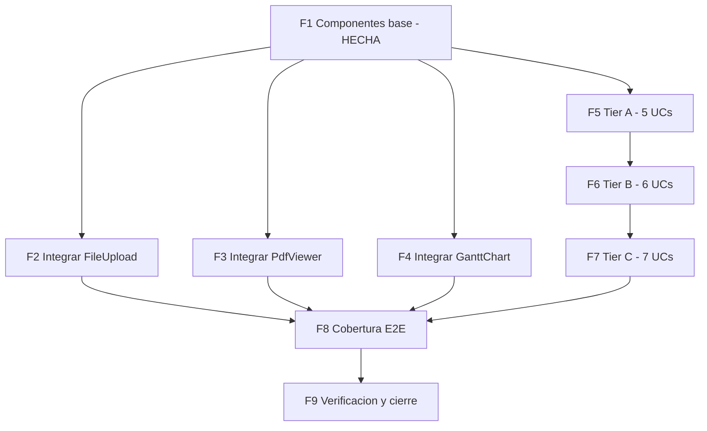

# Plan — componentes nativos (adaptar-componentes-kno-react)

**Creado:** 2026-06-02 · **Ampliado:** 2026-06-02 (cubre los 22 UCs)
**Estrategia:** un componente nativo por UC (sin importar `@progress/kno-*`),
con test, espejando convenciones del template (SCSS `@use '@styles/abstracts'`,
tokens `--ec-*`, JSX plano). **Una tarea atómica por archivo.** Componente+test
cuentan como una tarea (un agente por componente, como en F1). Verificación por
fase: jest + `check-scss` + `build:demo` (+ `test:e2e` en F8).

Cobertura total: **4 UCs ya hechos** (componentes) + **18 UCs nuevos**. Detalle
y evidencia de integración en `analisis-inventario-y-mapeo.md` y
`ucs-componentes-nativos.md`.

---

## FASE 1 — Componentes base nativos · HECHA

| Tarea | Archivo | UC | Estado |
|-------|---------|----|--------|
| F1-T1 | `common/ProductGallery/*` | UC-CAT-GAL | Hecha (12) |
| F1-T2 | `common/FileUpload/*` | UC-ADM-IMG/AVATAR | Hecha (6) |
| F1-T3 | `common/GanttChart/*` | UC-LOG-GANTT | Hecha (9) |
| F1-T4 | `common/PdfViewer/*` | UC-ORD-PDF | Hecha (6) |
| F1-T5 | Integrar ProductGallery en `ProductPage.jsx` | UC-CAT-GAL | Hecha |

---

## FASE 2 — Integrar FileUpload (UC-ADM-IMG + UC-ACC-AVATAR)

| Tarea | Archivo | Cambio atómico |
|-------|---------|----------------|
| F2-T1 | `pages/admin/AdminProductDetailPage.jsx` | `ImageGallery`: input file → `<FileUpload accept="image/*" multiple onFiles=…>` (conserva `uploadProductImage`) |
| F2-T2 | `pages/account/ProfilePage.jsx` | Avatar: input file → `<FileUpload accept="image/jpeg,image/png" maxSizeMB={5} onFiles=…>` |
| F2-T3 | `pages/admin/AdminProductDetailPage.test.jsx` | Aserción: subir vía FileUpload dispara `uploadProductImage` |
| F2-T4 | `pages/account/ProfilePage.test.jsx` | Aserción avatar vía FileUpload (crear si no existe) |

---

## FASE 3 — Integrar PdfViewer + factura (UC-ORD-PDF)

Fuente del PDF en DEMO: **asset mock estático** (sin libs).

| Tarea | Archivo | Cambio atómico |
|-------|---------|----------------|
| F3-T1 | `public/mock/factura-demo.pdf` (nuevo) | PDF mínimo de muestra |
| F3-T2 | `webpack.config.js` | CopyPlugin DEMO: `public/mock` → `dist/mock` |
| F3-T3 | `mocks/factories/order.ts` | Pedidos demo con `invoice_url: '/mock/factura-demo.pdf'` |
| F3-T4 | `pages/account/OrderDetailPage.jsx` | Sección "Ver factura" con `<PdfViewer url={order.invoice_url} …>` |
| F3-T5 | `pages/account/OrderDetailPage.test.jsx` | Con `invoice_url` renderiza visor; sin él, no |

---

## FASE 4 — Integrar GanttChart (UC-LOG-GANTT)

| Tarea | Archivo | Cambio atómico |
|-------|---------|----------------|
| F4-T1 | `mocks/factories/order.ts` | `fulfillment_stages: [{id,name,start,end,progress}]` en el pedido demo |
| F4-T2 | `pages/admin/AdminOrderDetailPage.jsx` | Bloque "Línea de tiempo de fulfillment" con `<GanttChart tasks=…>` |
| F4-T3 | `pages/admin/AdminOrderDetailPage.test.jsx` | El Gantt renderiza una barra por etapa |

---

## FASE 5 — Tier A (5 UCs nuevos: datos/endpoint ya existen)

Patrón por UC: **(C)** componente+test, **(D)** datos/mock si hace falta,
**(I)** integración, **(T)** test de integración.

### UC-ADM-SORT — reordenar imágenes (`sortable`)
| Tarea | Archivo | Cambio |
|-------|---------|--------|
| F5-T1 (C) | `common/SortableList/*` | Lista con reordenamiento por drag (teclado accesible) + test |
| F5-T2 (I) | `pages/admin/AdminProductDetailPage.jsx` | Imágenes reordenables → `reorderProductImages({order})` |
| F5-T3 (T) | `pages/admin/AdminProductDetailPage.test.jsx` | Reordenar dispara `reorderProductImages` con el nuevo orden |

### UC-ADM-RTE — editor enriquecido (`editor`)
| Tarea | Archivo | Cambio |
|-------|---------|--------|
| F5-T4 (C) | `common/RichTextEditor/*` | `contentEditable` + toolbar (negrita, lista, enlace) + test |
| F5-T5 (I) | `pages/admin/AdminProductForm.jsx` | Descripción de producto con RichTextEditor |
| F5-T6 (I) | `pages/admin/AdminStaticPageEditorPage.jsx` | Cuerpo de página estática con RichTextEditor |
| F5-T7 (T) | tests de ambas páginas | Editar emite HTML al guardar |

### UC-ADM-XLSX — exportar a hoja (`excel-export`)
| Tarea | Archivo | Cambio |
|-------|---------|--------|
| F5-T8 (C) | `utils/exportSheet.js` + test | Export **CSV nativo** (sin dep); XLSX real quedaría como opción con `jszip` |
| F5-T9 (I) | `pages/admin/AdminOrdersPage.jsx` | Botón "Exportar" → `exportSheet(pedidos)` |
| F5-T10 (I) | `pages/admin/AdminReportPage.jsx` | Botón "Exportar" del reporte |
| F5-T11 (T) | tests | Click genera el blob con las filas correctas |

### UC-ADM-KANBAN — tablero de pedidos (`taskboard`)
| Tarea | Archivo | Cambio |
|-------|---------|--------|
| F5-T12 (C) | `common/KanbanBoard/*` | Columnas + tarjetas; mover tarjeta emite `onMove(card,status)` + test |
| F5-T13 (I) | `pages/admin/AdminOrdersDashboardPage.jsx` | Vista kanban de pedidos por estado; mover → `PATCH status` |
| F5-T14 (T) | test | Mover una tarjeta dispara el cambio de estado |

### UC-CAT-TREE — filtro por árbol de categorías (`treeview`)
| Tarea | Archivo | Cambio |
|-------|---------|--------|
| F5-T15 (C) | `common/TreeView/*` | Árbol expandible accesible (`role="tree"`) + test |
| F5-T16 (D) | `mocks/data/catalog.ts` o handler categorías | Garantizar jerarquía padre/hijo de categorías |
| F5-T17 (I) | `components/catalog/CatalogFilters.jsx` | Categorías como TreeView (selección de slug) |
| F5-T18 (T) | `components/catalog/CatalogFilters.test.jsx` | Seleccionar nodo actualiza `?category=` |

**Verificación F5:** jest de componentes+páginas verdes; check-scss clean.

---

## FASE 6 — Tier B (6 UCs nuevos: storefront / vista nueva)

### UC-CAT-LIST — toggle lista/grid (`listview`)
| F6-T1 (C) | `common/ViewToggle/*` + test | Conmutador grid↔lista accesible |
| F6-T2 (I) | `pages/catalog/CatalogPage.jsx` | Render lista o grid según el toggle (estado en URL) |
| F6-T3 (T) | `pages/catalog/CatalogPage.test.jsx` | Cambiar a lista re-renderiza el layout |

### UC-CHT-FREESHIP — progreso a envío gratis (`progressbars`)
| F6-T4 (C) | `common/ProgressBar/*` + test | Barra con valor/umbral y `role="progressbar"` |
| F6-T5 (I) | `pages/cart/CartPage.jsx` | "Te faltan $X para envío gratis" según subtotal vs umbral |
| F6-T6 (T) | `pages/cart/CartPage.test.jsx` | Mensaje/relleno acorde al subtotal |

### UC-CHT-SCHED — agendar entrega (`scheduler`)
| F6-T7 (C) | `common/DeliveryScheduler/*` + test | Selector de fecha/slot accesible |
| F6-T8 (D) | `mocks/handlers/checkout.ts` | Slots de entrega mock |
| F6-T9 (I) | `pages/checkout/CheckoutPage.jsx` | Paso "Fecha de entrega" con el scheduler |
| F6-T10 (T) | test checkout | Elegir slot lo adjunta al pedido |

### UC-CAT-FAQ — acordeón de preguntas (`layout`/PanelBar)
| F6-T11 (C) | `common/Accordion/*` + test | Paneles colapsables accesibles (`aria-expanded`) |
| F6-T12 (I) | `pages/catalog/ProductPage.jsx` | Sección FAQ/Q&A con Accordion (usa `useProductQuestions`) |
| F6-T13 (T) | test ProductPage | Expandir muestra la respuesta |

### UC-ADM-GRID — tabla avanzada (`grid`)
| F6-T14 (C) | `common/DataGrid/*` + test | Orden por columna, filtro, paginación |
| F6-T15 (I) | `pages/admin/AdminTablePage.*` o listado | Sustituir una tabla básica por DataGrid |
| F6-T16 (T) | test | Ordenar/filtrar/paginar funciona |

### UC-ADM-TREELIST — árbol editable de categorías (`treelist`)
| F6-T17 (C) | `common/TreeList/*` + test | Árbol con columnas/acciones |
| F6-T18 (I) | `pages/admin/AdminCategoriesPage.jsx` | Categorías jerárquicas con TreeList |
| F6-T19 (T) | test | Render del árbol + acción por fila |

**Verificación F6:** jest verde; check-scss clean.

---

## FASE 7 — Tier C (7 UCs nuevos: analítica / soporte / niche)

### UC-ADM-GAUGE — KPIs tipo dial (`gauges`)
| F7-T1 (C) | `common/Gauge/*` + test | Gauge radial SVG con valor/umbral |
| F7-T2 (I) | `pages/admin/AdminDashboardPage.jsx` | Gauges de stock/meta |
| F7-T3 (T) | test | Render con el valor dado |

### UC-LOG-MAP — mapa de cobertura (`map`)
| F7-T4 (C) | `common/CoverageMap/*` + test | **SVG estático** de zonas (sin tiles externos en DEMO) |
| F7-T5 (D) | `mocks/handlers/logistics` | Zonas/puntos mock |
| F7-T6 (I) | `pages/admin/AdminLogisticsPage.jsx` | Mapa de cobertura |
| F7-T7 (T) | test | Render de zonas |

### UC-SUP-CHAT — chat de soporte (`conversational-ui`)
| F7-T8 (C) | `common/ChatWidget/*` + test | Hilo de mensajes + input + burbujas |
| F7-T9 (D) | `mocks/handlers/support.ts` | Endpoint de chat mock (eco/autorespuesta) |
| F7-T10 (I) | layout storefront o `SupportPage` | Widget flotante de chat |
| F7-T11 (T) | test | Enviar mensaje lo añade al hilo |

### UC-ORD-PDFGEN — factura PDF en cliente (`pdf`) · DECISIÓN
| F7-T12 | — | **Bloqueada por decisión**: requiere lib (`jspdf`/`pdf-lib`), rompe "sin deps". Si se aprueba: componente `InvoicePdf` que genera el PDF desde el pedido y lo pasa a `PdfViewer`. Por defecto se queda el asset mock (UC-ORD-PDF). |

### UC-ADM-PIVOT — reporte pivote (`pivotgrid`)
| F7-T13 (C) | `common/PivotTable/*` + test | Agregación filas×columnas |
| F7-T14 (I) | `pages/admin/AdminReportPage.jsx` | Pivote de ventas |
| F7-T15 (T) | test | Suma por celda correcta |

### UC-ADM-SHEET — edición masiva tipo hoja (`spreadsheet`)
| F7-T16 (C) | `common/DataSheet/*` + test | Grid editable por celda |
| F7-T17 (I) | `pages/admin/AdminPriceSyncPage.jsx` | Edición de precios en hoja |
| F7-T18 (T) | test | Editar celda emite el cambio |

### UC-ADM-LISTBOX — asignación dual-list (`listbox`)
| F7-T19 (C) | `common/DualListBox/*` + test | Mover ítems entre dos listas |
| F7-T20 (I) | `pages/admin/AdminProductForm.jsx` | Asignar tags/categorías |
| F7-T21 (T) | test | Mover ítem actualiza la selección |

**Verificación F7:** jest verde; check-scss clean.

---

## FASE 8 — Cobertura E2E (browser real)

Un check por integración con punto verificable (login admin donde aplique).

| Tarea | Archivo nuevo en `tests/e2e/checks/` | Cubre |
|-------|---------------------------------------|-------|
| F8-T1 | `07-product-gallery.mjs` | UC-CAT-GAL |
| F8-T2 | `08-admin-upload.mjs` | UC-ADM-IMG |
| F8-T3 | `09-order-invoice-pdf.mjs` | UC-ORD-PDF |
| F8-T4 | `10-admin-gantt.mjs` | UC-LOG-GANTT |
| F8-T5 | `11-admin-sort-images.mjs` | UC-ADM-SORT |
| F8-T6 | `12-admin-rte.mjs` | UC-ADM-RTE |
| F8-T7 | `13-admin-export.mjs` | UC-ADM-XLSX |
| F8-T8 | `14-admin-kanban.mjs` | UC-ADM-KANBAN |
| F8-T9 | `15-catalog-tree.mjs` | UC-CAT-TREE |
| F8-T10 | `16-catalog-list-toggle.mjs` | UC-CAT-LIST |
| F8-T11 | `17-cart-freeship.mjs` | UC-CHT-FREESHIP |
| F8-T12 | `18-checkout-schedule.mjs` | UC-CHT-SCHED |
| F8-T13 | `19-product-faq.mjs` | UC-CAT-FAQ |
| F8-T14 | `20-admin-grid.mjs` | UC-ADM-GRID |
| F8-T15 | `21-admin-treelist.mjs` | UC-ADM-TREELIST |
| F8-T16 | `22-admin-gauge.mjs` | UC-ADM-GAUGE |
| F8-T17 | `23-logistics-map.mjs` | UC-LOG-MAP |
| F8-T18 | `24-support-chat.mjs` | UC-SUP-CHAT |
| F8-T19 | `25-admin-pivot.mjs` | UC-ADM-PIVOT |
| F8-T20 | `26-admin-sheet.mjs` | UC-ADM-SHEET |
| F8-T21 | `27-admin-listbox.mjs` | UC-ADM-LISTBOX |

---

## FASE 9 — Verificación final y cierre

| Tarea | Acción |
|-------|--------|
| F9-T1 | `npx jest` (suite completa) → 0 fallos |
| F9-T2 | `node scripts/check-scss.mjs` clean; `build:demo` OK |
| F9-T3 | `npm run test:e2e` → 0 fail |
| F9-T4 | Actualizar `ucs-componentes-nativos.md`, `tareas-*`, `progreso-*` |
| F9-T5 | Commits (uno por UC/fase, Tim Pope) + push |
| F9-T6 | `decisiones-componentes-nativos.md` al cerrar |

---

## Criterios de cierre

- [ ] Los 22 UCs integrados (o documentada la razón de diferir: UC-ORD-PDFGEN).
- [ ] Cada UC con unit test + check E2E.
- [x] F1 componentes base con tests verdes.
- [ ] jest 0 fallos, check-scss clean, build:demo OK, test:e2e 0 fail.
- [ ] Docs actualizados; commits + push.

## Decisiones / límites de "sin dependencias"

- **UC-ADM-XLSX**: export **CSV nativo** por defecto. XLSX-binario real
  requeriría `jszip` → opcional, fuera del alcance "sin deps".
- **UC-ORD-PDFGEN**: generación de PDF en cliente requiere `jspdf`/`pdf-lib`
  → **bloqueada por decisión**; por defecto se usa el asset mock (UC-ORD-PDF).
- **UC-LOG-MAP**: SVG estático de zonas en DEMO (sin tiles/servicios externos).
- **UC-SUP-CHAT**: backend del chat = MSW mock (eco/autorespuesta) en DEMO.

## Orden de ejecución sugerido

F2–F4 (integraciones de lo ya hecho) en paralelo → F5 (Tier A) → F6 (Tier B) →
F7 (Tier C) → F8 (E2E) → F9 (cierre). Dentro de cada fase, los componentes son
independientes y se paralelizan **un agente por componente/página**.
