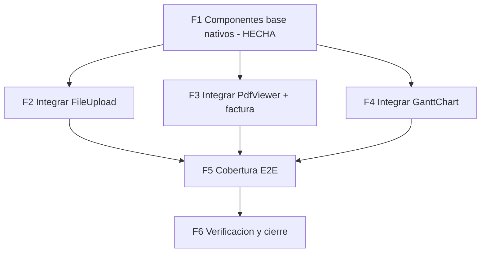

# Plan — componentes nativos (adaptar-componentes-kno-react)

**Creado:** 2026-06-02
**Estrategia:** un componente nativo por UC (sin importar `@progress/kno-*`),
con test, espejando convenciones del template (SCSS `@use '@styles/abstracts'`,
tokens `--ec-*`, JSX plano). Integración incremental: **una tarea atómica por
archivo**. Verificación por fase: jest + `check-scss` + `build:demo` (+ `test:e2e`
donde aplique).

UCs cubiertos: **UC-CAT-GAL** (galería), **UC-ADM-IMG** (imágenes de producto),
**UC-ACC-AVATAR** (avatar), **UC-ORD-PDF** (factura PDF), **UC-LOG-GANTT**
(timeline de fulfillment). Detalle en `ucs-componentes-nativos.md`.

---

## FASE 1 — Componentes base nativos · HECHA

| Tarea | Archivo | UC | Estado |
|-------|---------|----|--------|
| F1-T1 | `src/components/common/ProductGallery/*` | UC-CAT-GAL | Hecha (12 tests) |
| F1-T2 | `src/components/common/FileUpload/*` | UC-ADM-IMG/AVATAR | Hecha (6 tests) |
| F1-T3 | `src/components/common/GanttChart/*` | UC-LOG-GANTT | Hecha (9 tests) |
| F1-T4 | `src/components/common/PdfViewer/*` | UC-ORD-PDF | Hecha (6 tests) |
| F1-T5 | Integrar ProductGallery en `ProductPage` | UC-CAT-GAL | Hecha |

---

## FASE 2 — Integrar FileUpload (UC-ADM-IMG + UC-ACC-AVATAR)

**Objetivo:** sustituir los `<input type="file">` crudos por el componente
`FileUpload` (drag-drop, preview, validación), conservando los dispatch/handlers
actuales.

| Tarea | Archivo (único) | Cambio atómico |
|-------|-----------------|----------------|
| F2-T1 | `src/pages/admin/AdminProductDetailPage.jsx` | En el sub-componente `ImageGallery`, reemplazar el `<input type="file" multiple accept="image/*">` por `<FileUpload accept="image/*" multiple onFiles={files => files.forEach(f => onUpload(f))} />`. Mantener `onUpload`/`uploadProductImage`. |
| F2-T2 | `src/pages/account/ProfilePage.jsx` | Reemplazar el `<input type="file" accept="image/jpeg,image/png">` del avatar por `<FileUpload accept="image/jpeg,image/png" maxSizeMB={5} onFiles={files => handleAvatar(files[0])} />`. Adaptar `handleAvatar` para recibir el File. |
| F2-T3 | `src/pages/admin/AdminProductDetailPage.test.jsx` | Ajustar/añadir aserción: subir un archivo vía FileUpload dispara `uploadProductImage` (el test que buscaba el input por `aria-label` se actualiza al nuevo árbol). |
| F2-T4 | `src/pages/account/ProfilePage.test.jsx` (o donde viva) | Aserción equivalente para el avatar. Si no existe test, crearlo mínimo. |

**Verificación F2:** `npx jest` de esas páginas + `FileUpload` verdes; check-scss clean.

---

## FASE 3 — Integrar PdfViewer + factura (UC-ORD-PDF)

**Decisión de la fuente del PDF (DEMO_MODE):** asset **PDF mock estático**
servido junto al bundle demo. Es la opción sin librerías nuevas ni backend;
la generación en cliente (jspdf/pdf-lib) queda fuera de alcance por ahora.

| Tarea | Archivo (único) | Cambio atómico |
|-------|-----------------|----------------|
| F3-T1 | `public/mock/factura-demo.pdf` (nuevo) | Añadir un PDF mínimo de muestra (factura demo). |
| F3-T2 | `webpack.config.js` | En el bloque `isDemoMode && new CopyPlugin`, añadir patrón `public/mock` → `dist/mock`. |
| F3-T3 | `src/mocks/factories/order.ts` (o `src/mocks/handlers/orders.ts`) | En los pedidos demo, setear `invoice_url: '/mock/factura-demo.pdf'`. |
| F3-T4 | `src/pages/account/OrderDetailPage.jsx` | Junto al enlace "Descargar factura", añadir una sección "Ver factura" con `<PdfViewer url={order.invoice_url} title={\`Factura ${order.order_number}\`} />` (visible solo si `order.invoice_url`). |
| F3-T5 | `src/pages/account/OrderDetailPage.test.jsx` | Aserción: con `invoice_url`, se renderiza el `iframe`/acción del visor; sin `invoice_url`, no. |

**Verificación F3:** jest OrderDetailPage + PdfViewer verdes; check-scss clean;
`build:demo` copia `dist/mock/factura-demo.pdf`.

---

## FASE 4 — Integrar GanttChart (UC-LOG-GANTT)

**Hogar elegido:** `AdminOrderDetailPage` — timeline de fulfillment del pedido
(las etapas con fecha son el dato natural para el Gantt). `AdminLogisticsPage`
queda como extensión opcional (vista de envíos).

| Tarea | Archivo (único) | Cambio atómico |
|-------|-----------------|----------------|
| F4-T1 | `src/mocks/factories/order.ts` | Garantizar que el pedido demo trae etapas datadas para el Gantt: `fulfillment_stages: [{ id, name, start, end, progress }]` (o derivarlas de `status_logs` con timestamps). Añadir si faltan. |
| F4-T2 | `src/pages/admin/AdminOrderDetailPage.jsx` | Añadir un bloque "Línea de tiempo de fulfillment" con `<GanttChart tasks={order.fulfillment_stages} />`. |
| F4-T3 | `src/pages/admin/AdminOrderDetailPage.test.jsx` | Aserción: el Gantt renderiza una barra por etapa (aria-label por etapa). |

**Verificación F4:** jest AdminOrderDetailPage + GanttChart verdes; check-scss clean.

---

## FASE 5 — Cobertura E2E (browser real)

| Tarea | Archivo (único) | Cambio atómico |
|-------|-----------------|----------------|
| F5-T1 | `tests/e2e/checks/07-product-gallery.mjs` (nuevo) | Ficha de producto: thumbnail cambia la imagen principal; next/prev funcionan. |
| F5-T2 | `tests/e2e/checks/08-admin-upload.mjs` (nuevo) | Login admin → AdminProductDetail → la dropzone de FileUpload aparece y acepta un archivo (preview). |
| F5-T3 | `tests/e2e/checks/09-order-invoice-pdf.mjs` (nuevo) | Login → OrderDetail con `invoice_url` → el `iframe` del PdfViewer carga `/mock/factura-demo.pdf`. |
| F5-T4 | `tests/e2e/checks/10-admin-gantt.mjs` (nuevo) | Login admin → AdminOrderDetail → el Gantt renderiza barras de etapas. |

**Verificación F5:** `npm run test:e2e` con los checks nuevos en PASS/WARN.

---

## FASE 6 — Verificación final y cierre

| Tarea | Acción |
|-------|--------|
| F6-T1 | `npx jest` (suite completa) → 0 fallos |
| F6-T2 | `node scripts/check-scss.mjs` → clean; `DEMO_MODE=true npm run build:demo` → OK |
| F6-T3 | `npm run test:e2e` → 0 fail |
| F6-T4 | Actualizar `ucs-componentes-nativos.md`, `tareas-*`, `progreso-*` (marcar integraciones HECHAS) |
| F6-T5 | Commit (uno por fase, Tim Pope) + push a la rama |

---

## Criterios de cierre de la iniciativa

- [ ] Los 4 componentes integrados en sus páginas (F2-F4).
- [ ] Cada integración con test unitario + check E2E.
- [x] Componentes base con tests verdes (F1).
- [ ] jest 0 fallos, check-scss clean, build:demo OK, test:e2e 0 fail.
- [ ] Docs (UCs/tareas/progreso) actualizados; commits + push.

## Notas / decisiones abiertas

- **PDF**: se opta por asset mock estático en DEMO. Si más adelante se quiere
  factura real generada, sería una iniciativa aparte (añadir lib de PDF).
- **Gantt en logística**: `AdminLogisticsPage` (vista de envíos) es extensión
  opcional fuera de este plan; el plan integra el Gantt en el detalle de pedido.
- **Orden de ejecución sugerido**: F2 → F3 → F4 (independientes entre sí; pueden
  paralelizarse por agente, una página por agente), luego F5, luego F6.
