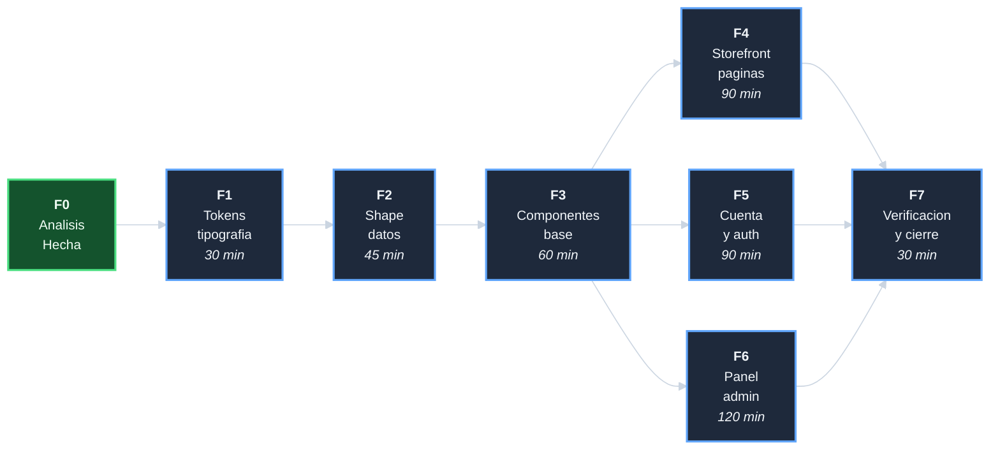

# Plan: Adaptar sistema de diseno Yoruba

## DAG de fases

F1 va primero — es la base visual de todo lo demas.
F2 va antes de F3 — los componentes usan los nuevos campos de datos.
F4, F5 y F6 son paralelos entre si despues de F3.

## F0 - Analisis + PM docs (hecha)

Inventario del paquete de referencia, 8 hallazgos criticos, estrategia
de adaptacion selectiva. Ver `analisis-adaptar-sistema-diseno-yoruba.md`.

**Entregables**: 5 documentos PM en `adaptar-sistema-diseno-yoruba/`.

## F1 - Tokens y tipografia (30 min)

Reemplazar la paleta generica por la paleta del brazalete. Es la base
de todo lo que sigue. Todas las paginas que usan variables semanticas
se re-skinean automaticamente.

T-101: Auditar hex hardcodeados en SCSS (riesgo de colores rotos).
T-102..T-107: `_variables.scss`, `_typography.scss`, alias `@assets`,
logo, verificacion de build.

**Entregables**: paleta del brazalete activa en toda la app; build OK.

## F2 - Adaptacion del shape de datos (45 min)

Los componentes del paquete usan `product.image_url` (string plano).
Nuestro catalogo genera `product.images[0].url` (array). Los action
creators `toggleWishlist`, `fetchFeaturedProducts` y `fetchCategories`
tampoco existen.

T-201..T-206: agregar `image_url` en el script de transformacion,
`toggleWishlist` en wishlistSlice, dos thunks en catalogSlice,
soporte `?is_featured=true` en el handler MSW.

**Entregables**: shape de producto compatible con los componentes del
paquete; slices con los action creators necesarios.

## F3 - Componentes base (60 min)

Header, Footer y ProductCard son los componentes que aparecen en todas
las paginas. Deben adaptarse (no copiarse directamente) por H-01, H-02
y H-07 (imagen, orisha, rutas).

T-301..T-306: Header con paleta Yoruba y rutas EN, Footer nuevo,
ProductCard con imagen real y sin orisha_name, AccountSidebar y
primitives nuevos.

**Entregables**: app visualmente Yoruba en cualquier pagina que cargue.

## F4 - Paginas del storefront (90 min)

CatalogPage, ProductPage, HomePage, CartPage, CheckoutPage y paginas
de pago. Son las paginas que el comprador ve.

T-401..T-406: adaptacion de cada pagina verificando que los slices
existentes satisfacen sus necesidades.

**Entregables**: flujo completo de compra con diseno editorial Yoruba.

## F5 - Paginas de cuenta y auth (90 min)

Login (split editorial), registro, recuperacion de contrasena, dashboard
de cuenta, pedidos, wishlist, direcciones, seguridad.

T-501..T-505: adaptacion de cada pagina con slices existentes.

**Entregables**: area de cliente con diseno editorial Yoruba.

## F6 - Panel administrativo (120 min)

Dashboard admin, gestion de productos, pedidos, usuarios, categorias,
inventario, vales, configuracion de sitio, gateways, paginas estaticas,
operaciones masivas.

T-601..T-608: adoptar componentes de admin, adaptar paginas, agregar
thunks faltantes en adminSlice, merge manual del AppRouter.

**Entregables**: panel admin funcional con diseno del brazalete.

## F7 - Verificacion y cierre (30 min)

T-701..T-704: build demo sin errores, verificacion visual, tests sin
regresiones, decisiones-*.md, cierre.

**Entregables**: iniciativa cerrada con evidencia de verificacion.
