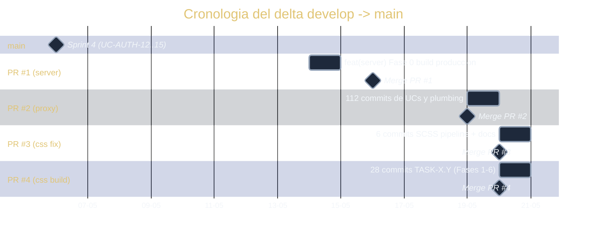
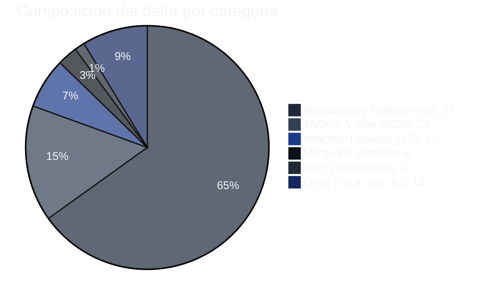

# Analisis del delta develop a main (release candidate)

| Campo | Valor |
|-------|-------|
| Rama base | `origin/main` (estable) |
| Rama adelantada | `origin/develop` (HEAD del flujo) |
| Commits en develop que no estan en main | 149 |
| Archivos diferentes | 386 |
| Lineas | +37704 / -533 |
| Fecha del ultimo commit en main | 2026-05-06 02:01 UTC |
| Fecha del ultimo commit en develop | 2026-05-20 06:05 UTC |
| Lapso del release candidate | 14 dias |
| Naturaleza | Release candidate acumulado (no promovido) |

## Por que existe este delta

`main` quedo en el commit
`feat(admin): Sprint 4 - Gestion de usuarios admin (UC-AUTH-12/13/14/15)`
el 2026-05-06. Desde entonces, todo el trabajo se hizo en `develop`
acumulando merges de PRs (#1 server, #2 proxy, #3 css fix, #4 css
build). Ningun release tag ni hotfix volvio a tocar `main`.

El resultado: `develop` tiene un release candidate completo con 86
casos de uso nuevos, sin promover.

## Composicion del delta por tipo de commit

| Tipo | Commits |
|------|---------|
| `feat(*)` | 97 |
| `refactor(*)` | 10 |
| `test(*)` | 2 |
| `TASK-X.Y` (plan SCSS de PR #4) | 23 |
| `Merge pull request` | 4 (PRs #1, #2, #3, #4) |
| Otros (track, document, fix, add, etc.) | 13 |

## Composicion del delta por scope

Conteo de `<scope>` en `feat(<scope>): ...`:

| Scope | Commits |
|-------|---------|
| `admin` | 14 |
| `orders` | 10 |
| `returns` | 7 |
| `payments` | 6 |
| `cart` | 6 |
| `support` | 5 |
| `inventory` | 5 |
| `dashboard` | 5 |
| `variants` | 4 |
| `reports` | 4 |
| `questions` | 4 |
| `newsletter` | 4 |
| `wishlist` | 3 |
| `contact` | 3 |
| `catalog` | 3 |
| `auth` | 3 |
| `reviews` | 2 |
| `notifications` | 2 |
| Otros (search, home, header, checkout, account, mocks, server) | 7 |

## Casos de uso unicos cubiertos por el delta

86 UCs distintos. Agrupados por dominio:

| Dominio | UCs | Cantidad |
|---------|-----|----------|
| Ordenes (`UC-ORD`) | 01..10 | 11 (incluye `UC-ORD-01`) |
| Catalogo (`UC-CAT`) | 03, 03-EXT, 04, 05, 06, 07, 09, 10, 11, 12 | 8 unicos en mensajes |
| Devoluciones (`UC-RET`) | 01..06 | 7 |
| Pagos (`UC-PAY`) | 01, 02, 05, 06, 08, 09, 11 | 6 |
| Carrito (`UC-CART`) | 01..06 | 6 |
| Soporte (`UC-SUPP`) | 01..05 | 5 |
| Inventario (`UC-INV`) | 01..05 | 5 |
| Dashboard (`UC-DASH`) | 01..04 | 5 (incluye un UC-DASH-02 con dos commits) |
| Admin (`UC-ADM`) | 01..05 | 5 |
| Reportes (`UC-REP`) | 01, 02, 04 | 4 (incluye `UC-REP-01..05` en uno) |
| Preguntas (`UC-QST`) | 01..04 | 4 |
| Newsletter (`UC-NEW`) | 01..04 | 4 |
| Variantes (`UC-CHT`) | 01..04 | 4 |
| Wishlist (`UC-WISH`) | 01..03 | 3 |
| Contacto (`UC-COM`) | 01..03 | 3 |
| Autenticacion (`UC-AUTH`) | 07, 08, 10 | 3 |
| Notificaciones (`UC-NOT`) | 06, 07 | 2 |
| Reviews (`UC-REV`) | 01..03 | 3 |
| Search history (`UC-SRCH`) | 03 | 1 |
| Promociones (`UC-PRO`) | 01 (vouchers TDD: 01, 02, 03 en un solo commit) | 1 |
| Logistica (`UC-LOG`) | 08 | 1 |

## Estructura interna del delta (cronologia)

## Distribucion fina dentro de los 149 commits

## Que falta para promover a main

Esto no es decision de la iniciativa, solo material para que el
equipo decida.

1. **Decision de proceso de release.** Promover los 149 commits en un
   solo evento es riesgoso (un solo rollout, una sola ventana para
   identificar regresion). Opciones:
   - **Big-bang:** una sola promocion. Bajo coste de coordinacion,
     alto riesgo de rollback amplio si algo falla.
   - **Por bloques tematicos:** promover por dominio (primero auth,
     luego orders, luego admin, etc.). Mas coordinacion pero rollback
     mas granular.
   - **Tags intermedios:** crear `v0.4.0`, `v0.5.0`, etc. en puntos
     estables de `develop` y promover por tag. Da puntos de rollback.

2. **Smoke test contra el bundle de produccion** construido con el
   estado actual de `develop`. Verifica que no hay regresion visible
   antes de tocar `main`.

3. **Changelog publicable** que liste los 86 UCs incorporados,
   agrupados por dominio. Este documento puede generarse mecanicamente
   a partir de los mensajes de commit con un filtro.

## Estado de `main` para hotfix

Mientras `main` siga 149 commits atras de `develop`, **hacer hotfix en
main es muy costoso**. Cualquier commit nuevo en `main` arrastra los
cambios al merge contra `develop`, o crea historia divergente.
Recomendacion implicita: o se promueve o se acepta que `main` esta
declarado obsoleto.

## Diagrama del delta en relacion al estado final

```mermaid
%%{init: {'theme':'base', 'themeVariables': {
  'background': '#0f172a',
  'primaryColor': '#1e293b',
  'primaryTextColor': '#f1f5f9',
  'primaryBorderColor': '#94a3b8',
  'lineColor': '#cbd5e1',
  'secondaryColor': '#334155',
  'tertiaryColor': '#1e3a8a',
  'fontSize': '13px'
}}}%%
flowchart LR
    rama_main_head_historica["<b>main</b><br/>HEAD historica"]
    pr_uno_server_fase_cero["<b>+1 commit</b><br/>PR #1 server<br/><i>Fase 0</i>"]
    pr_dos_proxy_ucs["<b>+115 commits</b><br/>PR #2 proxy<br/><i>86 UCs implementados</i>"]
    pr_tres_css_fix_pipeline["<b>+8 commits</b><br/>PR #3 css fix<br/><i>pipeline SCSS</i>"]
    pr_cuatro_css_build_tasks["<b>+30 commits</b><br/>PR #4 css build<br/><i>TASK 1.x a 6.x</i>"]
    rama_develop_head_actual["<b>develop</b><br/>HEAD actual"]
    resumen_delta_totales["Total: 149 commits<br/>386 archivos<br/>+37704 / -533 lineas"]

    rama_main_head_historica --> pr_uno_server_fase_cero
    pr_uno_server_fase_cero --> pr_dos_proxy_ucs
    pr_dos_proxy_ucs --> pr_tres_css_fix_pipeline
    pr_tres_css_fix_pipeline --> pr_cuatro_css_build_tasks
    pr_cuatro_css_build_tasks --> rama_develop_head_actual
    rama_develop_head_actual -. "resumen" .-> resumen_delta_totales

    classDef primaryNode fill:#1e293b,stroke:#60a5fa,stroke-width:2px,color:#f1f5f9
    classDef secondaryNode fill:#334155,stroke:#94a3b8,stroke-width:1px,color:#f1f5f9
    classDef doneNode fill:#14532d,stroke:#4ade80,stroke-width:2px,color:#f0fdf4
    classDef externalNode fill:#334155,stroke:#94a3b8,stroke-width:1px,color:#cbd5e1,stroke-dasharray: 5 5

    class rama_main_head_historica,rama_develop_head_actual primaryNode
    class pr_uno_server_fase_cero,pr_dos_proxy_ucs,pr_tres_css_fix_pipeline,pr_cuatro_css_build_tasks secondaryNode
    class resumen_delta_totales externalNode
```

## Riesgos asociados al delta no promovido

| Riesgo | Severidad | Documentado en |
|--------|-----------|----------------|
| Hotfix en main imposible sin arrastrar el delta | Media | `riesgos-y-deuda-tecnica/` (`riesgo-release-candidate-acumulado-en-develop`) |
| Versionamiento no refleja el estado real | Baja | `riesgos-y-deuda-tecnica/` (`deuda-delta-develop-a-main-no-promovido`) |
| Rollback de un release big-bang afecta 86 UCs a la vez | Media | (no listado todavia) |
| Develop puede romperse sin un buen estado al que regresar | Media | (no listado todavia) |
