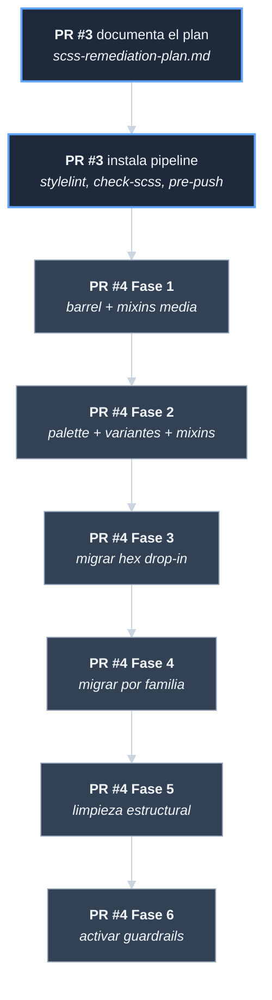

# Analisis de rama: claude/fix-npm-build-css-DBSPS (PR #4)

| Campo | Valor |
|-------|-------|
| Rama remota | `origin/claude/fix-npm-build-css-DBSPS` |
| Estado | **YA INTEGRADA** en `develop` (PR #4, merge `27640b2`) |
| Commits propios | 28 |
| Base de merge | `30c625d` (HEAD de PR #3 antes del merge) |
| Archivos tocados | 108 |
| Lineas | +872 / -729 |
| Fecha del primer commit | 2026-05-20 03:34 UTC |
| Fecha del ultimo commit | 2026-05-20 04:36 UTC |
| Naturaleza | Ejecucion del plan de remediacion SCSS (Fases 1 a 6) |

## Por que documentar esta rama

PR #4 ejecuta literalmente el plan documentado en PR #3
(`docs/scss-remediation-plan.md`). Sus 28 commits siguen una
nomenclatura estricta `TASK-X.Y` que mapea uno-a-uno con las tareas
del plan. Es la mejor evidencia de **planificacion atomica de
trabajo** que existe en el repo.

## Distribucion por fase del plan

El plan tiene seis fases. Cada commit `TASK-X.Y` ejecuta una tarea
de la fase X. Los commits `Track Phase X tasks as done in plan`
actualizan la tabla de progreso del plan.

| Fase | Tema | Commits TASK | Commits Track |
|------|------|--------------|---------------|
| 1 | Quick wins (cero decisiones) | `TASK-1.2`, `TASK-1.3` (y `TASK-1.1` quedo bloqueada) | `fcb9fd6`, `87bea6f` |
| 2 | Decisiones de catalogo (palette + mixins) | `TASK-2.1`, `TASK-2.2`, `TASK-2.3`, `TASK-2.4` | `1ff5f3b`, `9cd16ef` |
| 3 | Migracion de tokens drop-in | `TASK-3.1`, `TASK-3.2`, `TASK-3.3`, `TASK-3.4` | `08a1fdc` |
| 4 | Migracion por familia (danger, success, neutral, info, amber, indigo) | `TASK-4.1`, `TASK-4.2`, `TASK-4.3`, `TASK-4.4` | `3fd9932` |
| 5 | Limpieza y placeholders | `TASK-5.1`, `TASK-5.2`, `TASK-5.3` | `508f517` |
| 6 | Endurecimiento (reglas + docs) | `TASK-6.1`, `TASK-6.2`, `TASK-6.3` | `9175fea` |

## Tareas notables explicadas

### TASK-1.1 — Bloqueada

El plan tenia una tarea inicial sobre `@keyframes`. El commit
`87bea6f` la marca como bloqueada por una limitacion de `css-loader`
con localizacion de keyframes en SCSS Modules. Es un buen ejemplo de
**bloqueo declarado en lugar de oculto** — el procedimiento
PROC-GESTION-001 espera exactamente esto.

### TASK-1.2 — Unificar imports al barrel `@styles`

Antes: cada SCSS importaba `@use 'src/styles/abstracts/variables' as *`
con paths distintos.
Despues: todos importan `@use '@styles/abstracts' as *` (barrel).

### TASK-1.3 — Usar mixins de breakpoint en lugar de raw queries

Antes: `@media (max-width: 768px) { ... }`
Despues: `@include media-down-md { ... }`

### TASK-2.1 — Adoptar mixins semanticos en paginas

Mueve estilos repetidos a mixins canonicos.

### TASK-2.2 — Expandir paleta de estados

`success`, `danger`, `warning`, `info` ahora tienen variantes
`strong`, `deep`, `soft` para construir UI sin recurrir a `#hex`
ad-hoc.

### TASK-2.3 — Reemplazar `%btn` y `%badge` ad-hoc por mixins de
abstracts

Migra de placeholders SCSS locales a mixins canonicos.

### TASK-2.4 — Expandir paleta con escalas gray, amber, indigo

Anade `--color-gray-50..900`, `--color-amber-100..900`,
`--color-indigo-100..900`.

### TASK-3.1, 3.2, 3.3, 3.4 — Migracion drop-in

Reemplazos uno-a-uno de literales `#hex` por tokens:

- `TASK-3.1` — `#fff` -> `$bg-surface`
- `TASK-3.2` — `#b8860b` -> `$primary-color`
- `TASK-3.3` — `#e8e0d5` -> `$border-color`
- `TASK-3.4` — restantes drop-in matches

### TASK-4.x — Migracion por familia

- `TASK-4.1` — familia roja/danger
- `TASK-4.2` — familia verde/success
- `TASK-4.3` — familia neutral/text
- `TASK-4.4` — info/amber/indigo y residuales

### TASK-5.1, 5.2, 5.3 — Limpieza estructural

- `TASK-5.1` — `box-shadow` con valores magicos pasan a tokens.
- `TASK-5.2` — Regla vacia `.gallery` eliminada; reactivada
  `block-no-empty` en stylelint.
- `TASK-5.3` — Formas compartidas pasan a placeholders SCSS para
  eliminar `@extend` cross-archivo.

### TASK-6.1 — Activar `color-no-hex` con allowlist documentada

Aplica la regla a `*.module.scss`. La allowlist en `.stylelintrc.json`
permite excepciones con justificacion explicita.

### TASK-6.2 — `check-scss` rechaza imports no canonicos

`scripts/check-scss.mjs` (de PR #3) ahora falla si un SCSS importa
abstracts via path absoluto en lugar de `@styles`.

### TASK-6.3 — Actualizar la documentacion SCSS

Trae `docs/scss-pipeline.md` al estado final.

## Numeros del antes y despues

| Metrica | Antes de PR #3 + PR #4 | Despues |
|---------|------------------------|---------|
| Literales `#hex` en `src/` | 525 | 17 (en allowlist documentada) |
| Imports `@use` no canonicos | varios | 0 (rechazados por `check-scss`) |
| Mixins ad-hoc duplicados (`%btn`, `%badge`) | varios | 0 |
| Reglas SCSS vacias | varias | 0 (regla `block-no-empty` activa) |
| Documentacion del pipeline | 0 | 3 archivos (pipeline, audit, remediation-plan) |

## Estructura de un commit TASK-X.Y

Todos los commits TASK-X.Y siguen el mismo patron:

```
Subject: <accion concreta> (TASK-X.Y)

<descripcion del cambio>
<antes/despues si aplica>
<verificacion>
```

Es **el patron canonico** del repo para trabajo trazable.

## Relacion con el plan documentado

PR #3 introdujo `docs/scss-remediation-plan.md`. PR #4 lo ejecuto en
orden. Esto es **un ejemplo limpio del procedimiento
PROC-GESTION-001 en accion**: el plan funciona como `analisis-` y
`tareas-` (juntos), los commits TASK-X.Y son la ejecucion, los
commits `Track Phase X` son el `progreso-`.

Lo unico que falto para que PR #4 fuera una iniciativa completa
segun el procedimiento es el documento de `decisiones-`. Las
decisiones de fondo si quedaron documentadas en
`docs/decisiones-de-arquitectura/` (entradas
`dec-color-no-hex-con-allowlist-documentada` y
`dec-stylelint-y-checkscss-en-pre-push`), pero no en una iniciativa
formal aqui.

## Diagrama del flujo PR #3 -> PR #4



## Decisiones pendientes asociadas

| Decision | Notas |
|----------|-------|
| Borrar la rama del remoto | Trivial. Trabajo cerrado. |
| Mantener la allowlist plana o decreciente | Listada como deuda en `riesgos-y-deuda-tecnica/` (`deuda-de-allowlist-color-no-hex`). |
| Replicar este patron TASK-X.Y para futuros refactors | Recomendable. PR #4 demuestra que funciona. |
