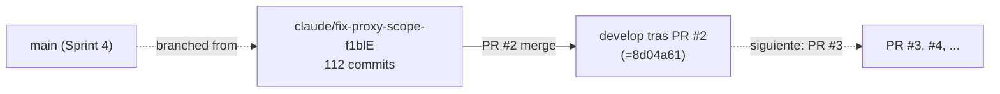

# Analisis de rama: claude/fix-proxy-scope-f1blE (PR #2)

| Campo | Valor |
|-------|-------|
| Rama remota | `origin/claude/fix-proxy-scope-f1blE` |
| Estado | **YA INTEGRADA** en `develop` (PR #2, merge `8d04a61`) |
| Commits propios | 112 |
| Base de merge | `86943a3` (HEAD historica de `main`) |
| Archivos tocados | 352 |
| Lineas | +35170 / -375 |
| Fecha de merge | 2026-05-19T22:46:56Z (commit local del usuario) |
| Naturaleza | Implementacion masiva de UCs y dominios |

## Por que documentar una rama ya integrada

PR #2 no es una rama cualquiera: es la **rama mas grande del proyecto**.
Su merge introdujo en `develop` la mayor parte del codigo productivo
actual:

- ~86 casos de uso distintos.
- 31 slices de Redux nuevos o ampliados.
- Decenas de paginas en cuenta del comprador, panel admin y storefront.
- Patrones canonicos (`serializeApiError`, React Query como reads, mocks
  cubriendo dominios nuevos).

Documentarla aqui sirve de **epitafio**: si en el futuro alguien borra
la rama del remoto, este documento conserva la historia.

## Distribucion de los 112 commits por dominio

Conteo por scope del mensaje de commit (`feat(<scope>): ...`):

| Scope | Commits | Tema |
|-------|---------|------|
| `admin` | 23 | Panel administrativo: dashboard, users, products, orders, vouchers, config, audit, backups, logistics, refunds. |
| `orders` | 10 | Vistas y flujos de ordenes (lado comprador y admin). |
| `returns` | 7 | Devoluciones (UC-RET-01..06): solicitar, listar, recibir, rechazar, reembolsar. |
| `payments` | 6 | Pagos (UC-PAY-01/02/05/06/08/09/11): MercadoPago, PayPal, history, retry, refund. |
| `cart` | 6 | Carrito: vacio, eliminar, cupon, save-for-later, sincronizar al login. |
| `support` | 5 | Tickets de soporte (UC-SUPP-01..05). |
| `inventory` | 5 | Inventario admin. |
| `dashboard` | 5 | Dashboards admin. |
| `yoruba` | 4 | Variantes Yoruba. |
| `reports` | 4 | Reportes admin. |
| `questions` | 4 | Preguntas de producto. |
| `newsletter` | 4 | Suscripcion. |
| `wishlist` | 3 | Lista de deseos. |
| `contact` | 3 | Formulario de contacto. |
| `catalog` | 3 | Filtros, busqueda dedicada, relacionados. |
| `auth` | 3 | Direcciones, cambio de password, verificacion. |
| `reviews` | 2 | Resenas (UC-REV-01/02/03). |
| `notifications` | 2 | Notificaciones del comprador. |
| `search` | 1 | Historial personal de busquedas. |
| `home` | 1 | Landing. |
| `header` | 1 | Badge de notificaciones. |
| `checkout` | 1 | Guest checkout (UC-ORD-01). |
| `account` | 1 | Sidebar completo. |
| `mocks` | 1 | Cobertura de returns + inventory. |

Mas refactors (`refactor(yoruba)`, `refactor(pages)`, `refactor(router)`,
`refactor(returns)`, `refactor(support)`, `refactor(inventory)`,
`refactor(vouchers)`) y tests aislados (`test(product)`, `test(inventory)`).

## Casos de uso entregados

Lista cruda de UCs identificables por mensajes de commit:

- AUTH: 07, 08, 10
- CART: 01..06 (los seis subUCs del carrito)
- CAT: 03, 03-EXT, 04, 05, 06, 07, 09, 10, 11, 12
- CHT: (chat de soporte, mencionado en refactor) 01, 02, 03, 04
- COM: 01, 02, 03 (contact)
- DASH: 01..04
- INV: 01..05
- LOG: 08
- NEW: 01..04 (newsletter)
- NOT: 06, 07
- ORD: 01 (guest), 02..10
- PAY: 01, 02, 05, 06, 08, 09, 11
- PRO: 01 (vouchers UI bajo TDD)
- QST: 01..04
- REP: 01, 02, 04
- RET: 01..06
- REV: 01, 02, 03
- SRCH: 03
- SUPP: 01..05
- WISH: 01, 02, 03

## Decisiones tecnicas visibles en los commits

Recogidas literalmente de los mensajes y referencias D-NNN:

| Decision | Commit | Resumen |
|----------|--------|---------|
| `D-008` | `fc22f40` | Returns acepta foto via multipart (alternativa elegida sobre URL pre-firmada). |
| `D-010` | `19f493a` | `serializeApiError` + React Query como patron canonico para reads. |
| `D-012` | `a249702` | Cableado del badge de notificaciones no leidas en el header. |
| `DEC-DOC-005, H-03` | `c28f171` | Rename de rutas espanol -> ingles (`/categorias` -> `/categories`, etc). |

## Tres commits finales de cierre

Antes del merge se anadieron tres commits para limpiar:

- `9bc2cbb` — "Align Header notifications test with /preferences route"
  (alinea un test que asumia ruta vieja).
- `0d54483` — "Fix three Codex review findings on PR #2" (hallazgos
  de la herramienta Codex review).
- `cda01e1` — "feat(admin): UC-CAT-12 sincronizar precios en lote
  (CSV + ajuste porcentual)" (ultimo UC anadido antes de cerrar el PR).

Es buena practica para futuros PRs: cerrar el alcance, atender review,
empujar fixes pequenos antes del merge.

## Relacion con las demas ramas

Esta rama es la **fuente** del enorme delta `develop` vs `main` que el
release candidate tiene que resolver. Sin PR #2, el delta seria de
~37 commits en lugar de 149.

## Decisiones pendientes asociadas a esta rama

| Decision | Notas |
|----------|-------|
| Borrar la rama del remoto | Trivial. Trabajo cerrado, no hay nada que rescatar. |
| Promover el bloque correspondiente de `develop` a `main` | Parte de la promocion completa del release candidate. Ver `analisis-delta-develop-a-main.md`. |
