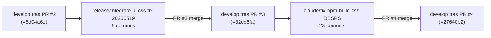

# Analisis de rama: release/integrate-ui-css-fix-20260519 (PR #3)

| Campo | Valor |
|-------|-------|
| Rama remota | `origin/release/integrate-ui-css-fix-20260519` |
| Estado | **YA INTEGRADA** en `develop` (PR #3, merge `32ce8fa`) |
| Commits propios (sobre el estado de PR #2) | 6 |
| Base de merge con develop | `30c625d` (HEAD de la propia rama) |
| Archivos tocados | 14 |
| Lineas | +2311 / -78 |
| Fecha del ultimo commit | 2026-05-20 03:25 UTC |
| Naturaleza | Bootstrap del pipeline SCSS (correcciones + guardas iniciales + documentacion) |

## Por que documentar esta rama

PR #3 es la **fundacion del pipeline SCSS endurecido** que mas tarde
PR #4 ampliaria. Sus seis commits estabilizan el build de estilos y
ponen las primeras guardas. Sin esta rama, los `#hex` literales
seguirian dispersos en `src/` sin proteccion automatizada.

## Los seis commits

Orden cronologico inverso (mas reciente arriba). Todos del mismo
autor, mismo dia (2026-05-20), aproximadamente entre 03:05 y 03:25 UTC.

### Commit `30c625d` — Documentar el plan de remediacion SCSS

Crea `docs/scss-remediation-plan.md`. Plan operativo derivado de
`scss-audit.md` organizado en 6 fases con tareas atomicas. Cada tarea
tiene ID estable (`TASK-X.Y`) para referenciar desde commits/PRs,
tipo (`cleanup`, `refactor`, `decision`, `structural`, `enforcement`),
esfuerzo (`XS`, `S`, `M`, `L`), accion concreta, aceptacion verificable
y dependencias.

Este plan es el que PR #4 ejecutaria despues.

### Commit `bae5481` — Documentar la auditoria SCSS

Crea `docs/scss-audit.md`. Auditoria del uso real de SCSS al momento:
duplicaciones, literales `#hex` (525 detectados), imports
inconsistentes, mixins ad-hoc vs canonicos.

### Commit `8750df4` — Documentar el pipeline SCSS y las guardas

Crea `docs/scss-pipeline.md`. Arquitectura de los estilos, stylelint,
sass-check y el pre-push hook. Sirve de referencia para quien quiera
entender por que existen las guardas.

### Commit `dfa2630` — Anadir husky pre-push para SCSS

Agrega `.husky/pre-push` que ejecuta `npm run lint:style` y
`npm run lint:scss-compile` antes de empujar al remoto. Razon: Jest
no compila SCSS, asi que un cambio en `_variables.scss` puede romper
el build de webpack y no salir en ningun test.

### Commit `b180133` — Anadir stylelint y check-scss

Anade `.stylelintrc.json` con `stylelint-scss` +
`stylelint-config-standard-scss` y el script
`scripts/check-scss.mjs` que verifica que el SCSS realmente compila a
CSS valido.

### Commit `c986320` — Fix del SCSS build completando abstracts aliases

Primer commit cronologico de la rama. Completa los aliases que faltaban
en `src/styles/abstracts/_variables.scss` y `_mixins.scss` para que
el barrel `@use '@styles/abstracts' as *;` resolviera todos los simbolos
que el codigo importaba.

## Tres categorias de cambio

Los 14 archivos modificados encajan en tres categorias:

| Categoria | Archivos | Naturaleza |
|-----------|----------|-----------|
| Configuracion de linting | `.stylelintrc.json`, `.husky/pre-push` | Activacion de stylelint + pre-push. |
| Scripts de soporte | `scripts/check-scss.mjs` | Verificacion programatica del build SCSS. |
| Fix de codigo + tokens | `src/styles/abstracts/_variables.scss`, `_mixins.scss` | Completar la API publica del barrel. |
| Documentacion | `docs/scss-pipeline.md`, `docs/scss-audit.md`, `docs/scss-remediation-plan.md` | Trazabilidad y guia. |

## Relacion con PR #2 y PR #4

PR #3 introduce la **infraestructura** del pipeline. PR #4 la usa
para **ejecutar el plan**: 23 commits `TASK-X.Y` que migran los 525
literales `#hex` a tokens, dejando solo 17 en allowlist documentada.

## Decisiones tecnicas visibles

| Decision | Donde se ve | Resumen |
|----------|-------------|---------|
| Pipeline en pre-push, no en CI | `.husky/pre-push` | Pre-push corre el check completo. Ver entrada `dec-stylelint-y-checkscss-en-pre-push` en `decisiones-de-arquitectura/`. |
| Check programatico de compilacion | `scripts/check-scss.mjs` | Jest no compila SCSS, por eso un script dedicado. |
| Documentacion del plan antes de ejecutarlo | `docs/scss-remediation-plan.md` | Permite revisar y aprobar el plan sin tener que examinar 28 commits despues. |

## Decisiones pendientes asociadas

| Decision | Notas |
|----------|-------|
| Borrar la rama del remoto | Trivial. Trabajo cerrado, no hay nada que rescatar. |
| Promover el bloque correspondiente de `develop` a `main` | Parte de la promocion completa del release candidate. Ver `analisis-delta-develop-a-main.md`. |
