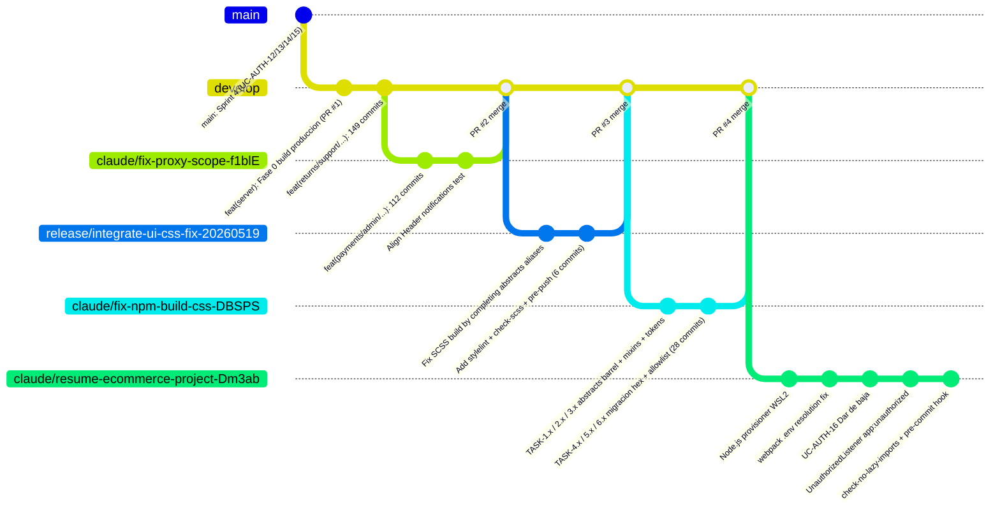

# Analisis: Ramas pendientes de integracion

| Campo | Valor |
|-------|-------|
| Iniciativa | analizar-ramas-pendientes-de-integracion |
| Tipo de documento | Resumen ejecutivo y matriz comparativa |
| Fecha del corte | 2026-05-20T19:12:38 |
| Comando de referencia | `git fetch --all && git for-each-ref refs/remotes/` |

## Resumen ejecutivo

El repositorio `jcg-admin/ecommerce-ui` tiene **seis ramas remotas** al
momento del corte. De ellas:

- **Una rama** esta verdaderamente pendiente de integrar:
  `claude/resume-ecommerce-project-Dm3ab`, con siete commits propios
  por delante de `develop` y un conflicto previsible y mecanico en
  `package.json`.
- **Tres ramas** ya estan integradas en `develop` via PRs cerrados
  (#2, #3, #4), pero permanecen en el remoto. No hay trabajo pendiente
  con ellas, salvo decidir si se borran.
- **Una rama** es la rama estable `main`, que esta 149 commits atras
  de `develop`. Esto constituye un **release candidate acumulado**.
- **Una rama** es la rama de integracion activa, `develop`, que es la
  HEAD por defecto del remoto.

## Inventario completo de ramas remotas

| Rama | Tipo | Commits ahead de develop | Commits behind develop | Estado |
|------|------|-------------------------|------------------------|--------|
| `origin/develop` | Integracion | - | - | HEAD activa del remoto. Acumula el release candidate. |
| `origin/main` | Estable | 0 | 149 | Atrasada 149 commits respecto a develop. Promocion pendiente. |
| `origin/claude/resume-ecommerce-project-Dm3ab` | Feature | **7** | 36 | **PENDIENTE DE INTEGRAR.** Una sola rama de feature con commits propios. |
| `origin/claude/fix-proxy-scope-f1blE` | Feature integrada | 0 | 37 | Ya integrada via PR #2 (commit `8d04a61`). 112 commits, ~86 UCs. |
| `origin/release/integrate-ui-css-fix-20260519` | Release branch integrada | 0 | 31 | Ya integrada via PR #3 (commit `32ce8fa`). 6 commits. Pipeline SCSS inicial. |
| `origin/claude/fix-npm-build-css-DBSPS` | Feature integrada | 0 | 3 | Ya integrada via PR #4 (commit `27640b2`). 28 commits. Migracion masiva a tokens. |

## Topologia de ramas

> Nota sobre el diagrama: la rama `claude/resume-ecommerce-project-Dm3ab`
> aparece como ultima pero su base de merge con `develop` esta en
> `8d04a61` (el merge de PR #2). Por eso esta `36 commits behind` de
> `develop` al momento del analisis: nunca recibio los cambios de
> PR #3 ni de PR #4.

## Matriz comparativa de las ramas con cambios

| Aspecto | resume-ecommerce-project | fix-proxy-scope (PR #2) | integrate-ui-css-fix (PR #3) | fix-npm-build-css (PR #4) | develop -> main |
|---------|------------------------|-------------------------|------------------------------|---------------------------|------------------|
| Estado | Pendiente | Integrada | Integrada | Integrada | RC pendiente |
| Commits propios | 7 | 112 | 6 | 28 | 149 |
| Archivos tocados | 15 | 352 | 14 | 108 | 386 |
| Lineas (+/-) | +1138 / -25 | +35170 / -375 | +2311 / -78 | +872 / -729 | +37704 / -533 |
| Naturaleza principal | Infra dev + 2 UCs + 1 listener + guard | Implementacion masiva de UCs y dominios | Pipeline SCSS y guardas iniciales | Endurecimiento SCSS por tokens | Acumulacion para release |
| UCs principales | UC-AUTH-16 | ~86 UCs (~ADM, ORD, PAY, RET, SUPP, ...) | ninguno (solo plumbing) | ninguno (solo refactor SCSS) | mismos 86 UCs |
| Conflicto previsto al merge | Si — `package.json` (scripts y engines) | n/a | n/a | n/a | n/a |
| Documento detallado | [analisis-rama-claude-resume-ecommerce-project.md](analisis-rama-claude-resume-ecommerce-project.md) | [analisis-rama-claude-fix-proxy-scope.md](analisis-rama-claude-fix-proxy-scope.md) | [analisis-rama-release-integrate-ui-css-fix.md](analisis-rama-release-integrate-ui-css-fix.md) | [analisis-rama-claude-fix-npm-build-css.md](analisis-rama-claude-fix-npm-build-css.md) | [analisis-delta-develop-a-main.md](analisis-delta-develop-a-main.md) |

## Decisiones que la documentacion habilita

La iniciativa **no toma** ninguna de estas decisiones. Solo provee el
material para que el equipo las tome.

| Decision | Material disponible |
|----------|---------------------|
| Integrar `claude/resume-ecommerce-project-Dm3ab` ahora vs esperar | Documento dedicado describe los 7 commits, el conflicto y los guardrails que aporta. |
| Promover `develop` a `main` ya | Inventario de los 149 commits agrupados por dominio en el documento de delta. |
| Borrar las tres ramas integradas del remoto | Cada rama tiene su `analisis-rama-*.md` que sirve de "epitafio" si se borra. |
| Disenar un proceso de release explicito (semver + tag + changelog) | El conteo de 149 commits sin promover ya es la evidencia de la necesidad. |
| Implementar CI/CD automatizado | Listado como riesgo abierto en `docs/riesgos-y-deuda-tecnica/`. |

## Priorizacion MoSCoW del trabajo de integracion futuro

La iniciativa actual produce documentacion. Los siguientes son
**candidatos a iniciativas separadas** que se podrian abrir despues:

| Prioridad | Iniciativa propuesta | Justificacion |
|-----------|---------------------|---------------|
| Must | `integrar-rama-resume-ecommerce-project-en-develop` | Los guardrails que aporta (listener 401, check-no-lazy-imports) son protecciones que ya deberian estar activas. |
| Must | `definir-proceso-promocion-develop-a-main` | 149 commits es demasiado para un solo evento de promocion. Necesita estrategia. |
| Should | `borrar-ramas-integradas-del-remoto` | Operacion trivial pero requiere acuerdo del equipo. |
| Could | `implementar-ci-cd-con-github-actions` | Mitiga el riesgo de build manual. |
| Could | `automatizar-validacion-de-contrato-api-vs-mocks` | Mitiga el riesgo de divergencia de mocks. |
| Won't (por ahora) | `migrar-src-a-typescript` | Deuda real pero no bloqueante. |
