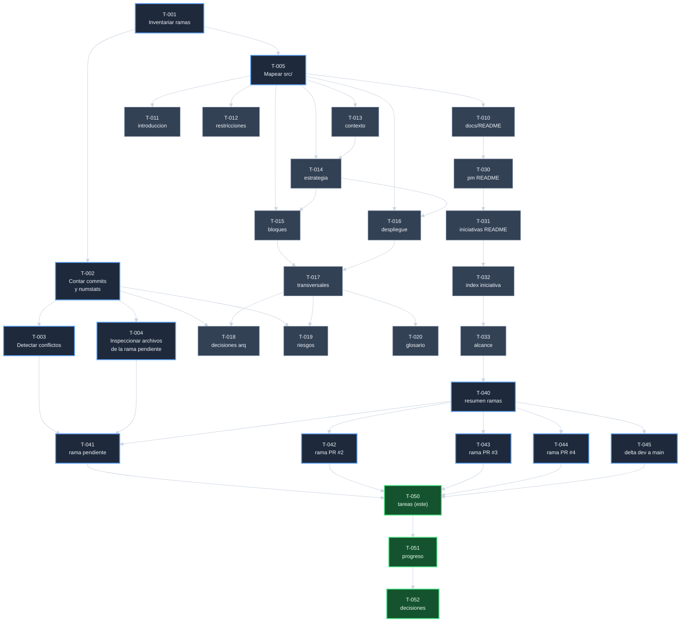

# Tareas: Analizar ramas pendientes de integracion

| Campo | Valor |
|-------|-------|
| Iniciativa | analizar-ramas-pendientes-de-integracion |
| Estado | Tareas completas |
| Version | 1.0.0 |
| Fecha de creacion | 2026-05-20T19:12:38 |
| Fecha de actualizacion | 2026-05-20T19:12:38 |

## Convencion

Cada tarea **T-NNN** toca exactamente un archivo del repo. Tiene
criterio de aceptacion binario (cumplido o no). El DAG indica orden
de ejecucion: una tarea arranca cuando todas sus predecesoras estan
completadas.

Por ser una iniciativa **de documentacion pura**, las tareas se mapean
uno a uno con archivos a crear bajo `docs/`. No hay ejecucion de
codigo, builds ni migraciones.

## Catalogo de tareas

### Fase A — Lectura del estado del repositorio

| ID | Tarea | Archivo / accion | Predecesoras |
|----|-------|------------------|---------------|
| T-001 | Inventariar las ramas remotas con `git for-each-ref` | (sin archivo) | - |
| T-002 | Para cada rama: contar commits ahead / behind respecto a develop, listar commits propios, hacer numstat | (sin archivo) | T-001 |
| T-003 | Identificar conflictos previsibles con `git merge-tree` para la rama pendiente | (sin archivo) | T-002 |
| T-004 | Inspeccionar archivos clave de la rama pendiente (provisioner, listener, check-no-lazy) | (sin archivo) | T-002 |
| T-005 | Mapear estructura de `src/`, slices, hooks, paginas | (sin archivo) | T-001 |

Las tareas de Fase A no producen archivo; producen el conocimiento que
permite escribir los archivos de Fase B y C. Son verificables por
ejecucion del comando git correspondiente.

### Fase B — Crear los cajones arc42

| ID | Tarea | Archivo a crear | Predecesoras |
|----|-------|-----------------|---------------|
| T-010 | Crear el indice raiz de docs | `docs/README.md` | T-005 |
| T-011 | Documentar introduccion y objetivos | `docs/introduccion-y-objetivos/introduccion-y-objetivos.md` | T-005 |
| T-012 | Documentar restricciones de arquitectura | `docs/restricciones-de-arquitectura/restricciones-de-arquitectura.md` | T-005 |
| T-013 | Documentar contexto y alcance del sistema | `docs/contexto-y-alcance-del-sistema/contexto-y-alcance-del-sistema.md` | T-005 |
| T-014 | Documentar estrategia de solucion | `docs/estrategia-de-solucion/estrategia-de-solucion.md` | T-005, T-013 |
| T-015 | Documentar vista de bloques de construccion | `docs/vista-de-bloques-de-construccion/vista-de-bloques-de-construccion.md` | T-005, T-014 |
| T-016 | Documentar vista de despliegue | `docs/vista-de-despliegue/vista-de-despliegue.md` | T-005, T-014 |
| T-017 | Documentar conceptos transversales | `docs/conceptos-transversales/conceptos-transversales.md` | T-015, T-016 |
| T-018 | Documentar decisiones de arquitectura | `docs/decisiones-de-arquitectura/decisiones-de-arquitectura.md` | T-002, T-017 |
| T-019 | Documentar riesgos y deuda tecnica | `docs/riesgos-y-deuda-tecnica/riesgos-y-deuda-tecnica.md` | T-002, T-017 |
| T-020 | Crear glosario | `docs/glosario/glosario.md` | T-017 |

### Fase C — Crear el modulo pm/

| ID | Tarea | Archivo a crear | Predecesoras |
|----|-------|-----------------|---------------|
| T-030 | Crear README de pm/ | `docs/pm/README.md` | T-010 |
| T-031 | Crear README de iniciativas/ | `docs/pm/iniciativas/README.md` | T-030 |
| T-032 | Crear index de la iniciativa | `docs/pm/iniciativas/analizar-ramas-pendientes-de-integracion/index.md` | T-031 |
| T-033 | Crear alcance de la iniciativa | `docs/pm/iniciativas/analizar-ramas-pendientes-de-integracion/alcance-analizar-ramas-pendientes-de-integracion.md` | T-032 |

### Fase D — Producir los analisis de ramas

| ID | Tarea | Archivo a crear | Predecesoras |
|----|-------|-----------------|---------------|
| T-040 | Producir el resumen ejecutivo y matriz comparativa | `docs/pm/iniciativas/analizar-ramas-pendientes-de-integracion/analisis-ramas-pendientes-de-integracion.md` | T-033 |
| T-041 | Producir el analisis detallado de la rama pendiente | `analisis-rama-claude-resume-ecommerce-project.md` | T-003, T-004, T-040 |
| T-042 | Producir el analisis de la rama PR #2 integrada | `analisis-rama-claude-fix-proxy-scope.md` | T-040 |
| T-043 | Producir el analisis de la rama PR #3 integrada | `analisis-rama-release-integrate-ui-css-fix.md` | T-040 |
| T-044 | Producir el analisis de la rama PR #4 integrada | `analisis-rama-claude-fix-npm-build-css.md` | T-040 |
| T-045 | Producir el analisis del delta develop a main | `analisis-delta-develop-a-main.md` | T-040 |

### Fase E — Cierre de la iniciativa

| ID | Tarea | Archivo a crear | Predecesoras |
|----|-------|-----------------|---------------|
| T-050 | Documentar las tareas atomicas con DAG | `tareas-analizar-ramas-pendientes-de-integracion.md` (este archivo) | T-041..T-045 |
| T-051 | Documentar el progreso con estado por tarea | `progreso-analizar-ramas-pendientes-de-integracion.md` | T-050 |
| T-052 | Documentar las decisiones de la iniciativa (obligatorio al cierre) | `decisiones-analizar-ramas-pendientes-de-integracion.md` | T-051 |

## DAG de dependencias

## Cobertura: criterio del alcance -> tareas que lo cubren

Cada criterio de completitud del alcance debe estar cubierto por al
menos una tarea. Esta tabla lo verifica:

| Criterio del alcance | Tareas que lo cubren |
|----------------------|----------------------|
| 1. Directorio `docs/` con cajones arc42 | T-010..T-020 |
| 2. `docs/pm/README.md` que explica el modulo | T-030 |
| 3. Seis documentos minimos de la iniciativa | T-032, T-033, T-040, T-050, T-051, T-052 |
| 4. Cada rama remota tiene parrafo descriptivo | T-040 (tabla comparativa) + T-041..T-045 (uno por rama) |
| 5. Rama pendiente con documento dedicado, commits, conflictos | T-041 |
| 6. Diagrama mermaid de topology + secuencia para listener | T-040 (gitGraph topology) + T-041 (sequenceDiagram listener) |
| 7. Sin emojis ni iconos en ningun archivo | Inspeccion visual por archivo (todas las tareas) |
| 8. Todos los nombres incluyen slug autoexplicativo | Convencion aplicada en T-010..T-052 |
| 9. Documento de decisiones con las tres secciones obligatorias | T-052 |

## Tareas que se desviaron del DAG durante la ejecucion

Ninguna. El DAG se respeto. Si en algun momento se hubiera necesitado
una tarea no prevista, se habria registrado aqui antes de ejecutarla
(regla del procedimiento).
