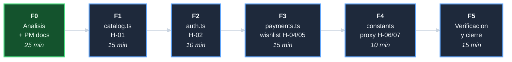

# Plan: Auditar y corregir inconsistencias

## DAG de fases

## F0 - Analisis + PM docs (25 min)

| Tarea | Descripcion | Esfuerzo |
|-------|-------------|----------|
| T-001 | Comparar paths de handlers MSW vs paths reales de la app | 15 min |
| T-002 | Crear 5 documentos PM | 10 min |

## F1 - Corregir catalog.ts — H-01 (15 min)

| Tarea | Descripcion | Esfuerzo |
|-------|-------------|----------|
| T-101 | Actualizar path `/api/products/` -> `/api/v1/catalogue/` en `catalog.ts` | 3 min |
| T-102 | Actualizar path `/api/products/search/` -> `/api/v1/catalogue/search/` | 2 min |
| T-103 | Actualizar path `/api/products/:slug/` -> `/api/v1/catalogue/:slug/` | 2 min |
| T-104 | Actualizar path `/api/categories/` -> `/api/v1/categories/` | 2 min |
| T-105 | Actualizar comentario JSDoc de `catalog.ts` con los paths correctos | 3 min |
| T-106 | Verificar que `catalogSlice.js` y `useCategories.js` usan los mismos paths | 3 min |

## F2 - Limpiar auth.ts — H-02 (10 min)

| Tarea | Descripcion | Esfuerzo |
|-------|-------------|----------|
| T-201 | Eliminar handlers legacy `/api/token/`, `/api/auth/logout/`, `/api/auth/register/`, `/api/auth/me/` de `auth.ts` | 5 min |
| T-202 | Actualizar comentario JSDoc de `auth.ts` | 5 min |

## F3 - Corregir payments.ts y wishlist — H-04, H-05 (15 min)

| Tarea | Descripcion | Esfuerzo |
|-------|-------------|----------|
| T-301 | Actualizar path `/api/payments/mercadopago/create/` -> `/api/v1/payments/mercadopago/checkout` en `payments.ts` | 3 min |
| T-302 | Actualizar path `/api/payments/paypal/create/` -> `/api/v1/payments/paypal/checkout` en `payments.ts` | 3 min |
| T-303 | Actualizar comentario JSDoc de `payments.ts` | 3 min |
| T-304 | Actualizar path `/api/wishlist/*` -> `/api/v1/wishlist/*` en `cart.ts` | 5 min |

## F4 - Limpiar constants y proxy — H-06, H-07 (10 min)

| Tarea | Descripcion | Esfuerzo |
|-------|-------------|----------|
| T-401 | Eliminar exportacion `API_BASE` de `constants/index.js` | 3 min |
| T-402 | Agregar comentario explicativo al proxy de devServer en `webpack.config.js` | 3 min |
| T-403 | Verificar que eliminar `API_BASE` no rompe ninguna importacion | 4 min |

## F5 - Verificacion y cierre (15 min)

| Tarea | Descripcion | Esfuerzo |
|-------|-------------|----------|
| T-501 | Confirmar que todos los paths de handlers coinciden con los paths de la app | 5 min |
| T-502 | Crear `decisiones-*.md`; actualizar index e indice; commit | 10 min |
