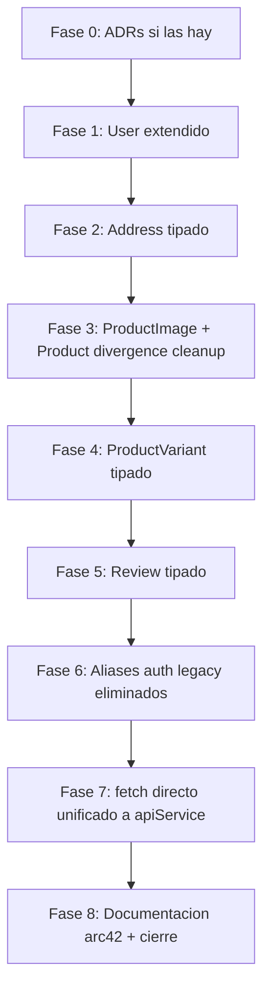

# Plan — `completar-dominio-de-ecommerce`

| Campo | Valor |
|-------|-------|
| Iniciativa | `completar-dominio-de-ecommerce` |
| Estado al producir este documento | En analisis (pasa a En ejecucion en commit del plan) |
| Fecha | 2026-05-21 |

## Estructura

El plan declara **fases** (grupos de tareas que comparten objetivo
arquitectonico) y **tareas atomicas T-NNN** (un commit cada una).
Sigue la disciplina del precedente `revisar-arquitectura-de-mocks`.

Las decisiones de proceso del alcance se aplican aqui:
- Una entidad = una fase.
- Tipo primero, runtime despues.
- Backend out-of-scope.

## DAG de fases

Fase 0 es la verificacion del paso 2 del procedimiento (ADRs previas)
**ya ejecutada** en la apertura: ninguna ADR contradice esta
iniciativa. El plan no declara ADRs nuevas previstas; si emergen
durante la ejecucion se anaden como tareas.

## Tareas

### Fase 1 — `User` extendido

| ID | Tarea | Coste | Dep |
|----|-------|-------|-----|
| T-001 | Inspeccionar `ProfilePage`, `authSlice` para confirmar campos `is_active`, `date_joined`, `email_verified` usados | 5 min | - |
| T-002 | Extender `User` en `domain.ts` con los campos confirmados; actualizar JSDoc para retirar el bloque "parcial" relacionado con verificacion y estado | 15 min | T-001 |

### Fase 2 — `Address` tipado

| ID | Tarea | Coste | Dep |
|----|-------|-------|-----|
| T-003 | Declarar `Address` en `domain.ts` con los 12 campos identificados | 20 min | - |

### Fase 3 — `ProductImage` + `Product` divergence cleanup

| ID | Tarea | Coste | Dep |
|----|-------|-------|-----|
| T-004 | Declarar `ProductImage` en `domain.ts`; anadir `images?: ProductImage[]`, `price?: number`, `original_price?: number | null` a `Product` con JSDoc explicando el rol legacy de `price`/`original_price` | 25 min | - |
| T-005 | Eliminar todos los `as unknown as Product` de `src/mocks/handlers/catalog.ts` y `src/mocks/factories/product.ts`; verificar `tsc --noEmit` exit 0 | 25 min | T-004 |

### Fase 4 — `ProductVariant` tipado

| ID | Tarea | Coste | Dep |
|----|-------|-------|-----|
| T-006 | Declarar `ProductVariant` en `domain.ts` con 5 campos; anadir `variants?: ProductVariant[]` al `Product` | 20 min | T-005 |
| T-007 | Anadir `createVariant()` a `src/mocks/factories/`; reemplazar el array inline en `factories/product.ts` por uso del factory | 20 min | T-006 |

### Fase 5 — `Review` tipado

| ID | Tarea | Coste | Dep |
|----|-------|-------|-----|
| T-008 | Inspeccionar `reviewsSlice.js`, `useReviews.js`, paginas, y handler MSW de reviews para extraer el shape completo del Review (campos, estados de moderacion) | 25 min | - |
| T-009 | Declarar `Review` y `ReviewModerationStatus` en `domain.ts` con los campos confirmados | 20 min | T-008 |
| T-010 | Crear factory `createReview` con Faker; actualizar handler de reviews si existe para usar el tipo | 15 min | T-009 |

### Fase 6 — Aliases auth legacy eliminados

| ID | Tarea | Coste | Dep |
|----|-------|-------|-----|
| T-011 | Verificar con grep que ningun thunk ni componente invoca `/api/token/`, `/api/auth/me/`, `/api/auth/logout/`, `/api/auth/register/` | 5 min | - |
| T-012 | Eliminar los 4 handlers de aliases legacy en `src/mocks/handlers/auth.ts`; validar 203 tests verdes | 20 min | T-011 |

### Fase 7 — `fetch` directo unificado a `apiService`

| ID | Tarea | Coste | Dep |
|----|-------|-------|-----|
| T-013 | Anadir thunks `requestPasswordReset` y `confirmPasswordReset` al `authSlice`; declarar UC-AUTH-09 fase 1 y 2 explicitamente en JSDoc | 30 min | - |
| T-014 | Refactorizar `ForgotPasswordPage.jsx`: eliminar `API_URL` y `fetch`, despachar `requestPasswordReset` | 15 min | T-013 |
| T-015 | Refactorizar `ResetPasswordPage.jsx`: eliminar `API_URL` y `fetch`, despachar `confirmPasswordReset` | 15 min | T-013 |

### Fase 8 — Documentacion arc42 + cierre

| ID | Tarea | Coste | Dep |
|----|-------|-------|-----|
| T-016 | Actualizar `docs/vista-de-bloques-de-construccion/vista-de-bloques-de-construccion.md` si la superficie publica cambia (en principio cambia la lista de tipos exportados de `domain.ts`) | 20 min | T-007, T-010, T-012, T-015 |
| T-017 | Producir `decisiones-completar-dominio-de-ecommerce.md` con las 4 secciones canonicas | 45 min | T-016 |
| T-018 | Cerrar iniciativa: indice global e index.md a `Cerrada` con fecha de cierre; entradas finales en `progreso-*.md` (Cambio de estado, Cierre de iniciativa) | 20 min | T-017 |

## Trazabilidad

| Item alcance | Fase | Tareas |
|--------------|------|--------|
| 1 User parcial | Fase 1 | T-001, T-002 |
| 2 Address no tipado | Fase 2 | T-003 |
| 3 ProductVariant no tipado | Fase 4 | T-006, T-007 |
| 4 Review no tipado | Fase 5 | T-008, T-009, T-010 |
| 5 Aliases auth legacy | Fase 6 | T-011, T-012 |
| 6 fetch directo | Fase 7 | T-013, T-014, T-015 |
| 7 Product divergence | Fase 3 | T-004, T-005 |
| (cierre) | Fase 8 | T-016, T-017, T-018 |

## Coste agregado

- 18 tareas atomicas
- ~360 minutos (~6h efectivas)

Excede levemente la estimacion ~4.5h del analisis porque incluye
inspeccion exploratoria (T-001, T-008, T-011) y documentacion
(T-016, T-017, T-018) que el analisis no presupuesto explicitamente.

## Criterio de listo para empezar

- Alcance producido (T-021 sin homonimo: estado actual).
- Analisis producido con hallazgo central registrado.
- Plan producido (este documento).
- Estado movido a `En ejecucion` en indice global e index.md.
- Working tree limpio antes de T-001.
