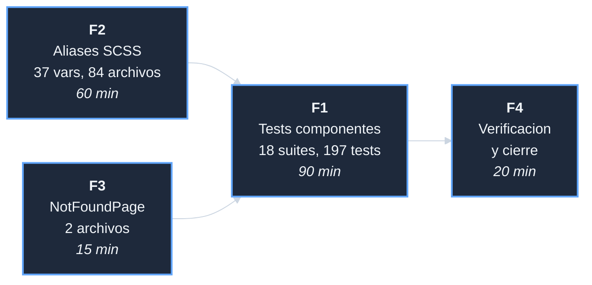

# Plan: Corregir deuda diseno Yoruba

## DAG de fases

F2 va antes de F1 porque corregir los aliases puede cambiar el
renderizado CSS que algunos tests verifican.
F3 va antes de F1 porque NotFoundPage.test.jsx podria fallar
si existe.

## F2 — Resolver aliases de compatibilidad (60 min)

37 variables legacy en 4 bloques al final de `_variables.scss`.
Las usan 84 archivos SCSS en 149 ocurrencias.

Para cada archivo con variables legacy: reemplazar el nombre legacy
por el nombre semantico de la nueva paleta segun el mapa del analisis
(D-02). Eliminar los 4 bloques de aliases de `_variables.scss`.
Verificar build sin errores tras cada lote de archivos.

**Entregables**: `_variables.scss` sin bloques de aliases. Todos
los modulos SCSS apuntan directamente a variables semanticas.

## F3 — Adaptar NotFoundPage (15 min)

La pagina fue omitida en F3 de `adaptar-sistema-diseno-yoruba` porque
esta en `src/pages/` raiz y el script de adaptacion procesaba solo
subdirectorios.

Dos archivos: `NotFoundPage.jsx` (adaptar rutas EN, adoptar version
del paquete) y `NotFoundPage.module.scss` (adoptar del paquete).

**Entregables**: NotFoundPage con diseno Yoruba editorial (MetaTag,
Button, 404 tipografico).

## F1 — Corregir tests de componentes (90 min)

18 suites, 197 tests. Por cada suite:

1. Leer el test y el componente que testa.
2. Determinar si el fallo es por markup cambiado, shape de datos
   incompatible, o feature eliminado.
3. Segun la causa:
   - Markup cambiado: actualizar los selectores del test para que
     usen los nuevos atributos/roles/texto del componente Yoruba.
   - Shape incompatible: actualizar el mock del test para usar
     el shape correcto del paquete Yoruba (ej. `product_name`
     en lugar de `name` para items de carrito).
   - Feature eliminado: evaluar si el feature debe volver al
     componente. Si no: eliminar el test con un comentario que
     explique por que ya no aplica.

Cada suite es una tarea atomica (un archivo de test = una tarea).

**Entregables**: `npm test -- --watchAll=false` con 0 suites fallidas.

## F4 — Verificacion y cierre (20 min)

`npm test` 0 fallos. `npm run build` EXIT=0.
`_variables.scss` sin aliases. `NotFoundPage` con diseno Yoruba.
`decisiones-*.md`, cierre, I-015, commit.
