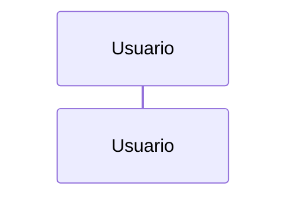
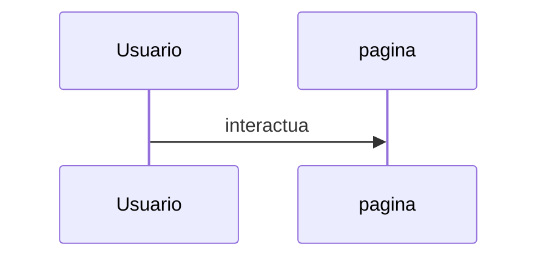

# Analisis: Corregir nomenclatura `ecommerce` y estilo de diagramas

## Inventario detallado de variantes detectadas

### En el repo UI (`template-ecommerce-ui`)

| # | Variante | Archivos | Lineas | Ejemplo de contexto | Accion |
|---|----------|----------|--------|---------------------|--------|
| 1 | `template-ecommerce-server` | 3 | 4 | "proyecto hermano `template-ecommerce-server`" | **Cambiar a `template-ecommerce-server`** |
| 2 | `template-ecommerce-ui` | 11 | 25 | URLs GitHub, refs a si mismo | **Cambiar a `template-ecommerce-ui`** |
| 3 | `ecommerce-ui-server` | 3 | 4 | menciones al server | **Cambiar a `template-ecommerce-server`** (la forma corta es ambigua; expandirla al nombre nuevo) |
| 4 | `ecommerce-ui` | 249 | 296 | paquete npm, comentarios JSDoc, README, docs | **Cambiar a `ecommerce-ui`** |
| 5 | `ecommerce-api` | 7 | 10 | refs hermano backend | **Cambiar a `ecommerce-api`** |
| 6 | `ecommerce-db` | 2 | 3 | refs hermano DB | **Cambiar a `ecommerce-db`** |
| 7 | `ecommerce-doc` | 6 | 11 | refs hermano docs | **Cambiar a `ecommerce-doc`** |
| 8 | `e-comerce-server` | 10 | 22 | 50% referente externo / 50% hermano | **CASO POR CASO**: referente externo NO se toca; hermano se cambia a `ecommerce-server` |

### Referencias que NO se tocan

| String | Archivos | Lineas | Razon |
|--------|----------|--------|-------|
| `jcg-admin/e-comerce-server` | varios | 6 | Repo externo real con ese nombre exacto en GitHub. |
| `ecomerce-p001` | varios | 6 | Nombre exacto del procedimiento externo `Procedimiento-Implementacion-Almacenamiento-WSL2-ecomerce-p001 v1.0.0`. |
| Commits historicos | 129 | N/A | Reescribir historia es destructivo. |
| `progreso-*.md` de iniciativas previas | 8 archivos | varios cientos | Bitacora historica, no se edita. |

### En el repo server (`template-ecomerce-ui-server`, a renombrar)

| Variante actual | Cambia a |
|-----------------|----------|
| `template-ecomerce-ui-server` (su nombre actual) | `template-ecommerce-server` |
| `template-ecommerce-ui` (refs al UI viejo) | `template-ecommerce-ui` |
| `ecommerce-ui` (forma corta) | `ecommerce-ui` |

## Validacion de no-colisiones

El string objetivo `ecommerce` (doble `m`) **YA EXISTE** en muchos
sitios del repo (e.g. en los nombres de iniciativas
`completar-dominio-de-ecommerce`, `ampliar-ucs-de-ecommerce`,
`corregir-nomenclatura-ecommerce-...`). Esto es **bueno**: confirma
que el target es el correcto y que no rompe nada.

**Riesgo identificado**: si el sed se ejecuta en cadena
(`s/e-comerce/ecommerce/g`) sobre un archivo que ya contiene
`ecommerce`, **no genera colisiones** porque el patron de busqueda
`e-comerce` (una `m`) y el target `ecommerce` (doble `m`) son
strings distintos. Verificado: ninguna combinacion produce
`ecommerceommerce` o similar.

**Patron de busqueda seguro**: usar el patron mas largo primero
para evitar reemplazos parciales:

1. `template-ecommerce-server` -> `template-ecommerce-server`
2. `template-ecommerce-ui` -> `template-ecommerce-ui`
3. `ecommerce-ui-server` -> `template-ecommerce-server`
4. `ecommerce-ui` -> `ecommerce-ui`
5. `ecommerce-api` -> `ecommerce-api`
6. `ecommerce-db` -> `ecommerce-db`
7. `ecommerce-doc` -> `ecommerce-doc`
8. `e-comerce-server` -> CASO POR CASO (no automatizable, requiere
   inspeccion linea por linea para distinguir referente externo de
   hermano)
9. `e-comerce` (huerfano, solo despues de los 8 anteriores) ->
   `ecommerce`

## Analisis del estilo Mermaid actual

### Inventario

19 diagramas en 15 archivos del UI. Cero tienen `%%{init: ...}%%`.

| Tipo | Archivos | Posicion de classDef |
|------|----------|---------------------|
| `flowchart` | 12 | Aplica `classDef`+`class` |
| `graph` | 1 | Aplica `classDef`+`class` (es alias de flowchart) |
| `sequenceDiagram` | 3 | NO aplica classDef |
| `gantt` | 1 | NO aplica classDef |
| `pie` | 1 | NO aplica classDef |
| `gitGraph` | 1 | NO aplica classDef |

### Convencion canonica a aplicar

```mermaid
%%{init: {'theme':'base', 'themeVariables': {
  'background': '#0f172a',
  'primaryColor': '#1e293b',
  'primaryTextColor': '#f1f5f9',
  'primaryBorderColor': '#94a3b8',
  'lineColor': '#cbd5e1',
  'secondaryColor': '#334155',
  'tertiaryColor': '#1e3a8a',
  'fontSize': '13px'
}}}%%
flowchart TB
    nodo_descriptivo_uno["<b>Nodo Uno</b>"]
    nodo_descriptivo_dos["<b>Nodo Dos</b>"]

    nodo_descriptivo_uno --> nodo_descriptivo_dos

    classDef primaryNode fill:#1e293b,stroke:#60a5fa,stroke-width:2px,color:#f1f5f9
    classDef secondaryNode fill:#334155,stroke:#94a3b8,stroke-width:1px,color:#f1f5f9
    classDef doneNode fill:#14532d,stroke:#4ade80,stroke-width:2px,color:#f0fdf4
    classDef warnNode fill:#7c2d12,stroke:#fb923c,stroke-width:2px,color:#fff7ed
    classDef externalNode fill:#334155,stroke:#94a3b8,stroke-width:1px,color:#cbd5e1,stroke-dasharray: 5 5

    class nodo_descriptivo_uno primaryNode
    class nodo_descriptivo_dos secondaryNode
```

### Reglas de aplicacion

1. **TODOS los nodos** usan identificadores `snake_case` descriptivos.
   **Prohibido**: alias cortos como `n`, `a`, `b`, `u`, `s`.
2. **Para flowchart/graph**: anadir las 5 classDef estandar
   (primaryNode, secondaryNode, doneNode, warnNode, externalNode) y
   aplicar `class` a cada nodo segun su semantica.
3. **Para sequenceDiagram**: solo aplicar el bloque `%%{init}%%`. Los
   `participant`s deben tener nombres descriptivos completos (no `U`,
   `P`, `H`). La sintaxis `participant nombre as Etiqueta Visible`
   es aceptable porque el alias `nombre` aqui es estructural (lo usa
   el resto del diagrama), no abreviado.
4. **Para gantt/pie/gitGraph**: solo aplicar el bloque `%%{init}%%`.

### Decision sobre `sequenceDiagram` y alias

En sequenceDiagram el patron natural es:

Aqui `U` es estructural (se usa para los mensajes `U->>P:`). **NO se
puede eliminar**, pero se debe **expandir** a algo descriptivo:

Esto cumple "no alias cortos" sin romper la sintaxis del lenguaje.

## Estrategia de ejecucion (resumen)

| Fase | Estrategia |
|------|------------|
| F1 backup | `tar czf` ambos repos con `.git/` completo + manifest + MD5. |
| F2 server | `mv` + `git remote add` + sed batch sobre 58 lineas + 1 commit. |
| F3 UI a si mismo | sed batch en este orden: variantes largas primero, luego cortas. 1 commit grande con todo el `ecommerce-ui` (249 archivos). |
| F4 cross-repo en UI | sed batch para `api`, `db`, `doc`. Manual caso por caso para `server`. |
| F5 Mermaid | Reescribir cada diagrama uno por uno (no automatizable; cada uno tiene estructura propia). |
| F6 verificacion | `npm run lint`, `npm test`, `npm run build`, `bash tests/run_all.sh` en server. |
| F7 cierre | Backup post + indice actualizado. |

## Riesgos identificados

| ID | Riesgo | Mitigacion |
|----|--------|------------|
| R-1 | sed accidental sobre `jcg-admin/e-comerce-server` (referente externo) | NO usar sed global para `e-comerce-server`; tratamiento manual con `grep -n` previo. |
| R-2 | sed accidental sobre `ecomerce-p001` (procedimiento externo) | Patron sed limita a `e-comerce` con guion antes; `ecomerce` (sin guion) NO matchea. |
| R-3 | `dist/` queda con strings viejos (compilados) | Regenerar en F6 con `npm run build`. |
| R-4 | Tests Jest rompen tras renombre | El renombre es solo de strings en comentarios + nombre del paquete; no afecta logica. Verificar en F6. |
| R-5 | Sub-cadenas inesperadas (e.g. `ecommerce-uix`) | Validacion previa: ningun archivo contiene variantes raras (verificado). |
| R-6 | Reescritura masiva genera commit gigante dificil de revisar | Subdividir por fase: F3 (refs a si mismo) y F4 (cross-repo) son commits separados. |
| R-7 | El server hermano tiene su propia historia cerrada que referencia el nombre viejo | NO se reescriben commits historicos (D-COMMITS-HISTORIA); las refs en archivos vivos del server SI se actualizan en F2. |
| R-8 | Inconsistencia visual en diagramas Mermaid: 19 tipos distintos, no todos llevan classDef | Documentado en analisis: aplicar plantilla completa solo a flowchart/graph; init theme a otros. |

## Conclusion del analisis

El cambio es **viable y de bajo riesgo tecnico** porque:

1. No afecta logica del codigo (solo strings cosmeticos + nombre del
   paquete + URLs).
2. No hay colisiones entre el string a buscar y el target.
3. El `dist/` se regenera; los maps quedaran consistentes.
4. Los tests existentes no dependen de los strings cambiados.
5. El server hermano ya esta cerrado y limpio; el renombre solo
   afecta archivos vivos.

**Esfuerzo justificado**: el typo `e-comerce` historico es deuda
documental visible; corregirlo ahora antes de pushear a GitHub
evita que el repo nazca publico con el error.
