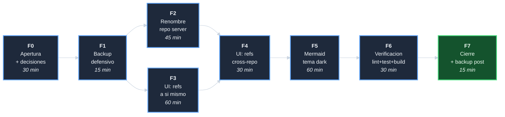
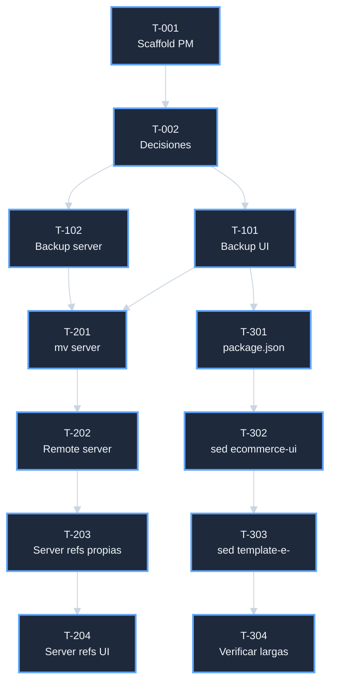

# Plan: Corregir nomenclatura `ecommerce` y estilo de diagramas

## DAG de fases

## F0 - Apertura + analisis + decisiones (30 min)

| Tarea | Descripcion | Esfuerzo |
|-------|-------------|----------|
| T-001 | Crear el directorio de la iniciativa + 5 docs PM (index, alcance, analisis, plan, tareas, progreso) | 25 min |
| T-002 | Aprobar las 7 decisiones D-* en el index | 5 min |

**Entregables**: scaffold completo de la iniciativa.

## F1 - Backup defensivo (15 min)

| Tarea | Descripcion | Esfuerzo |
|-------|-------------|----------|
| T-101 | Backup del UI con `.git/` + manifest + MD5 | 7 min |
| T-102 | Backup del server con `.git/` + manifest + MD5 | 7 min |

**Entregables**: 2 tarballs en `/tmp/backups/` con nombre
`PRE-NOMENCLATURA-<timestamp>`.

## F2 - Renombre repo server (45 min)

| Tarea | Descripcion | Esfuerzo |
|-------|-------------|----------|
| T-201 | `mv` del directorio `template-ecomerce-ui-server` -> `template-ecommerce-server` | 2 min |
| T-202 | Configurar remote del server: `git remote add origin https://github.com/jcg-admin/template-ecommerce-server.git` | 2 min |
| T-203 | Actualizar todas las refs internas del server (configs Nginx, scripts, docs vivos, README) que digan `template-ecomerce-ui-server` -> `template-ecommerce-server`. NO tocar bitacora `progreso-*.md` de la iniciativa cerrada. | 25 min |
| T-204 | Actualizar refs del server al UI: `template-ecommerce-ui` -> `template-ecommerce-ui` | 10 min |
| T-205 | Commit unitario en server con subject <=50 | 5 min |

**Entregables**: server renombrado, working tree limpio, refs cross-repo
al UI nuevo.

## F3 - Refs del UI a si mismo (60 min)

| Tarea | Descripcion | Esfuerzo |
|-------|-------------|----------|
| T-301 | Actualizar `package.json` y `package-lock.json` (`name: ecommerce-ui`, `description`) | 5 min |
| T-302 | sed batch sobre 249 archivos: `ecommerce-ui` -> `ecommerce-ui`. Excluir: `node_modules/`, `.git/`, `.cache/`, `dist/`, `package-lock.json` (ya hecho en T-301), bitacoras `progreso-*.md` de iniciativas cerradas/pausadas | 20 min |
| T-303 | sed batch para `template-ecommerce-ui` -> `template-ecommerce-ui` | 10 min |
| T-304 | Verificar manualmente las 11 lineas de la variante larga `template-ecommerce-server` (puede ser ambigua por la palabra `server`) | 10 min |
| T-305 | Verificar que cero `ecommerce-ui` huerfanos quedan en docs editables | 5 min |
| T-306 | Commit unitario en UI con subject <=50 | 10 min |

**Entregables**: UI con refs a si mismo corregidas, working tree
limpio.

## F4 - Refs cross-repo en el UI (30 min)

| Tarea | Descripcion | Esfuerzo |
|-------|-------------|----------|
| T-401 | sed batch: `ecommerce-api` -> `ecommerce-api` | 3 min |
| T-402 | sed batch: `ecommerce-db` -> `ecommerce-db` | 3 min |
| T-403 | sed batch: `ecommerce-doc` -> `ecommerce-doc` | 3 min |
| T-404 | CASO POR CASO: `e-comerce-server`. Grep linea por linea, distinguir referente externo (`jcg-admin/e-comerce-server`) de hermano (`ecommerce-server`). Aplicar cambio solo en hermano. | 15 min |
| T-405 | sed para huerfanos `e-comerce` (forma corta sin `-suffix`). Excluir las menciones a referente externo y procedimiento p001. | 3 min |
| T-406 | Commit unitario en UI con subject <=50 | 3 min |

**Entregables**: UI con cero apariciones de `e-comerce-*` editables
(excepto excepciones aprobadas).

## F5 - Mermaid tema dark canonico (60 min)

| Tarea | Descripcion | Esfuerzo |
|-------|-------------|----------|
| T-501 | Aplicar plantilla completa a los 13 `flowchart`/`graph` (12 flowchart + 1 graph): bloque init + classDef + class + identificadores `snake_case` descriptivos | 35 min |
| T-502 | Aplicar solo bloque init a los 6 no-flowchart (3 sequenceDiagram + 1 gantt + 1 pie + 1 gitGraph). Expandir alias cortos en sequenceDiagram (`U as Usuario` -> `usuario as Usuario`). | 20 min |
| T-503 | Commit unitario en UI con subject <=50 | 5 min |

**Entregables**: 19 diagramas con estilo canonico.

## F6 - Verificacion (30 min)

| Tarea | Descripcion | Esfuerzo |
|-------|-------------|----------|
| T-601 | UI: `npm run lint` (espera 0 errores) | 5 min |
| T-602 | UI: `npm test` (espera baseline 2 failed / 813 passed) | 10 min |
| T-603 | UI: `npm run build` (regenera `dist/` con strings nuevos compilados) | 10 min |
| T-604 | Server: `bash tests/run_all.sh` (espera 5 suites OK, 72 PASS / 0 FAIL / 1 SKIP) | 3 min |
| T-605 | Commit del `dist/` regenerado si aplica (o `.gitignore` lo excluye -- a decidir caso por caso) | 2 min |

**Entregables**: pipeline verde en ambos repos.

## F7 - Cierre (15 min)

| Tarea | Descripcion | Esfuerzo |
|-------|-------------|----------|
| T-701 | Backup post-cambios de ambos repos | 7 min |
| T-702 | Actualizar `docs/pm/iniciativas/indice-de-iniciativas.md` agregando esta iniciativa cerrada | 5 min |
| T-703 | Commit final de cierre con subject <=50 | 3 min |

**Entregables**: iniciativa cerrada formalmente, 2 backups
`POST-NOMENCLATURA-<timestamp>` en `/tmp/backups/`.

## Totales

| Fase | Tareas | Esfuerzo |
|------|--------|----------|
| F0 | 2 | 30 min |
| F1 | 2 | 15 min |
| F2 | 5 | 45 min |
| F3 | 6 | 60 min |
| F4 | 6 | 30 min |
| F5 | 3 | 60 min |
| F6 | 5 | 30 min |
| F7 | 3 | 15 min |
| **TOTAL** | **32** | **~285 min (4h 45min)** |

## Dependencias entre fases

*(DAG simplificado mostrando solo las primeras 12 tareas; F4-F7
siguen secuencialmente).*

## Convenciones aplicadas

- **Subject Tim Pope <=50 chars** vigilado en cada commit.
- **Hallazgos atomizados** registrados como eventos
  `Hallazgo durante la ejecucion` independientes en
  `progreso-*.md`.
- **Identificadores Mermaid `snake_case` descriptivos** -- aplicado
  en ESTE plan tambien (auto-cumplimiento).
- **Decisiones formales** aprobadas en F0/T-002 con prefijo `D-*`.
