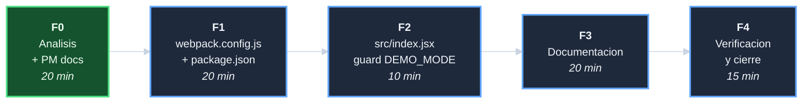

# Plan: Habilitar MSW en modo demo

## DAG de fases

## F0 - Analisis + PM docs (20 min)

| Tarea | Descripcion | Esfuerzo |
|-------|-------------|----------|
| T-001 | Diagnosticar por que el dist/ no carga datos; evaluar alternativas; decidir DEMO_MODE | 10 min |
| T-002 | Crear 5 documentos PM siguiendo el formato del repo UI | 10 min |

**Entregables**: 5 archivos PM en `habilitar-msw-en-modo-demo/`.

## F1 - webpack.config.js + package.json (20 min)

| Tarea | Descripcion | Esfuerzo |
|-------|-------------|----------|
| T-101 | Verificar si `copy-webpack-plugin` esta en devDependencies; instalar si no | 3 min |
| T-102 | Leer `DEMO_MODE` del entorno en `webpack.config.js` y pasarlo a `DefinePlugin` | 5 min |
| T-103 | Agregar `copy-webpack-plugin` condicional en webpack: copia `mockServiceWorker.js` a `dist/` solo cuando `DEMO_MODE=true` | 7 min |
| T-104 | Agregar script `build:demo` en `package.json` | 5 min |

**Entregables**: `webpack.config.js` y `package.json` actualizados.

## F2 - src/index.jsx guard DEMO_MODE (10 min)

| Tarea | Descripcion | Esfuerzo |
|-------|-------------|----------|
| T-201 | Extender el guard en `src/index.jsx`: MSW arranca si `NODE_ENV !== 'production'` O si `DEMO_MODE === 'true'` | 10 min |

**Entregables**: `src/index.jsx` con guard extendido.

## F3 - Documentacion (20 min)

| Tarea | Descripcion | Esfuerzo |
|-------|-------------|----------|
| T-301 | Actualizar `README.md`: agregar seccion de modo demo con `npm run build:demo` | 10 min |
| T-302 | Actualizar `docs/vista-de-despliegue/`: agregar fila "Build demo" en tabla de entornos | 5 min |
| T-303 | Agregar nota de extension en `docs/decisiones-de-arquitectura/` en la ADR `dec-mocks-via-msw-service-worker` | 5 min |

**Entregables**: README, vista-de-despliegue y ADR actualizados.

## F4 - Verificacion y cierre (15 min)

| Tarea | Descripcion | Esfuerzo |
|-------|-------------|----------|
| T-401 | Verificar que `npm run build:demo` produce `dist/` con `mockServiceWorker.js` | 5 min |
| T-402 | Verificar que `npm run build` sin `DEMO_MODE` NO copia `mockServiceWorker.js` | 3 min |
| T-403 | Crear `decisiones-habilitar-msw-en-modo-demo.md`; actualizar index e indice de iniciativas; commit de cierre | 7 min |

**Entregables**: `decisiones-*.md`; iniciativa cerrada.
