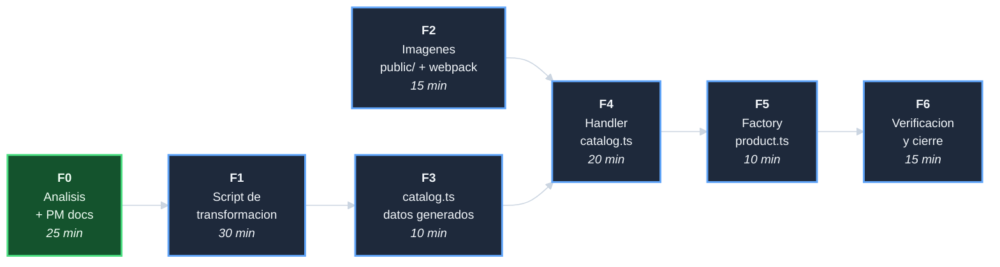

# Plan: Integrar catalogo Oja en mocks

## DAG de fases

F1 y F2 son paralelos (no dependen entre si).
F3 depende de F1 (usa el script para generar los datos).
F4 depende de F2 y F3 (necesita las imagenes y los datos).

## F0 - Analisis + PM docs (25 min)

| Tarea | Descripcion | Esfuerzo |
|-------|-------------|----------|
| T-001 | Analizar el catalogo: peso de imagenes, campos, categorias, casos especiales | 15 min |
| T-002 | Crear 5 documentos PM | 10 min |

## F1 - Script de transformacion (30 min)

| Tarea | Descripcion | Esfuerzo |
|-------|-------------|----------|
| T-101 | Crear `scripts/transform-catalog.mjs`: lee JSON fuente, mapea campos ES->EN, genera `src/mocks/data/catalog.ts` | 25 min |
| T-102 | Verificar que el script genera datos validos (256 productos, 14 categorias, paths de imagen correctos) | 5 min |

## F2 - Imagenes: public/ + webpack (15 min)

| Tarea | Descripcion | Esfuerzo |
|-------|-------------|----------|
| T-201 | Copiar 320 PNGs a `public/catalog/images/` | 3 min |
| T-202 | Extender `CopyPlugin` en `webpack.config.js` para incluir `catalog/images/` en DEMO_MODE | 7 min |
| T-203 | Verificar que `npm run dev` sirve las imagenes en `/catalog/images/` | 5 min |

## F3 - Datos generados (10 min)

| Tarea | Descripcion | Esfuerzo |
|-------|-------------|----------|
| T-301 | Ejecutar `scripts/transform-catalog.mjs` con el JSON fuente | 2 min |
| T-302 | Revisar `src/mocks/data/catalog.ts` generado: estructura correcta, sin datos corruptos | 8 min |

## F4 - Handler catalog.ts (20 min)

| Tarea | Descripcion | Esfuerzo |
|-------|-------------|----------|
| T-401 | Importar `CATALOG_PRODUCTS` y `CATALOG_CATEGORIES` en `catalog.ts` | 3 min |
| T-402 | Reemplazar handler `GET /api/v1/catalogue/`: paginacion sobre `CATALOG_PRODUCTS` | 5 min |
| T-403 | Reemplazar handler `GET /api/v1/catalogue/:slug/`: busqueda en `CATALOG_PRODUCTS` | 5 min |
| T-404 | Reemplazar handler `GET /api/v1/catalogue/search/`: filtro por nombre en `CATALOG_PRODUCTS` | 5 min |
| T-405 | Reemplazar handler `GET /api/v1/categories/`: retornar `CATALOG_CATEGORIES` | 2 min |

## F5 - Factory product.ts (10 min)

| Tarea | Descripcion | Esfuerzo |
|-------|-------------|----------|
| T-501 | Actualizar `CATEGORIES` en `product.ts` con las 14 categorias reales | 10 min |

## F6 - Verificacion y cierre (15 min)

| Tarea | Descripcion | Esfuerzo |
|-------|-------------|----------|
| T-601 | Verificar estructura de `catalog.ts`: 256 productos, 14 categorias, paths de imagen validos | 5 min |
| T-602 | Verificar que `npm run build:demo` incluye `dist/catalog/images/` y no `npm run build` | 5 min |
| T-603 | Crear `decisiones-*.md`; actualizar index e indice; commit de cierre | 5 min |
