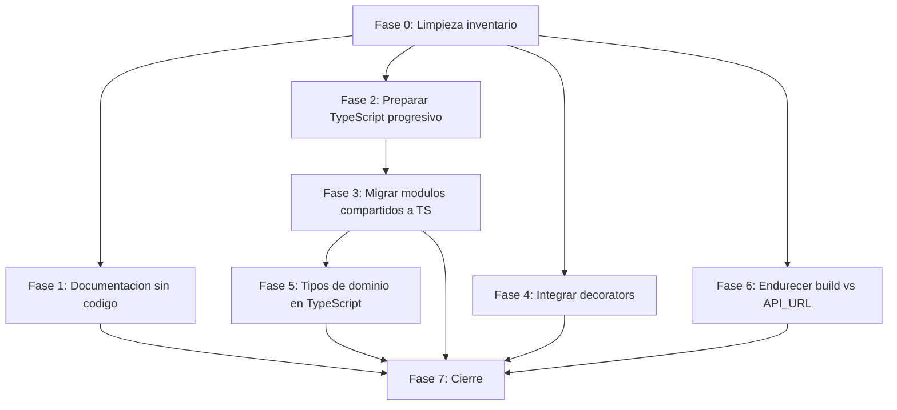

# Plan de ejecucion: Resolver hallazgos de deuda del template

| Campo | Valor |
|-------|-------|
| Iniciativa | resolver-hallazgos-de-deuda-del-template |
| Tipo | Plan de ejecucion por fases con tareas atomicas |
| Estado | Pendiente de aprobacion |
| Fecha de creacion | 2026-05-20T21:09:03 |
| Fecha de revision con decisiones aplicadas | 2026-05-20T21:30:00 |

## Estructura del plan

El trabajo se ordena en **7 fases secuenciales** (0 a 6). Cada fase
agrupa tareas atomicas T-NNN que comparten contexto y dependencias.
Dentro de una fase, las tareas pueden ejecutarse en paralelo salvo
dependencia explicita.

Las fases mas tempranas (0, 1) no tocan codigo de produccion y
pueden ejecutarse sin riesgo. Las intermedias (2, 3) preparan el
terreno tecnico para las posteriores. Las finales (4, 5) implementan
los hallazgos. La fase 6 cierra la iniciativa.

**Cobertura**: 5 hallazgos (H-01, H-02, H-03, H-04, H-08) mas la
limpieza del inventario (H-06, H-09 a H-20). Los hallazgos H-05 y
H-07 se delegan a iniciativas propias y no estan en este plan; el
documento de alcance los referencia con su slug.

## Regla de tarea atomica

Cada T-NNN cumple los siguientes invariantes:

- Una sola intencion. La tarea hace una cosa identificable, no varias.
- Un solo commit Tim Pope. Sin commits encadenados.
- Tiempo estimado entre 5 y 30 minutos. Si excede 30, se subdivide.
- Toca entre 1 y 5 archivos. Excepciones documentadas en la tarea.
- Tiene criterio de hecho verificable mecanicamente.
- Tiene referencia explicita al ID del hallazgo H-NN que aborda.

## Diagrama del DAG de fases

> Nota: las fases 4, 5 y 6 no tienen dependencia entre si, asi que
> pueden ejecutarse en paralelo si hay varios revisores. La fase 5
> si depende de la 3 (necesita PropShapes ya migrado).

## Fase 0: Limpieza del inventario

**Proposito**: retirar del inventario los 13 hallazgos que no aplican
al template y marcar los 2 delegados (H-05, H-07). Esta fase no toca
codigo y desbloquea todo lo demas.

**Hallazgos cubiertos**: H-05 y H-07 (marcado de delegacion), H-06,
H-09, H-10, H-11, H-12, H-13, H-14, H-15, H-16, H-17, H-18, H-19,
H-20 (retiro).

### T-001 — Retirar 5 entradas historicas del inventario de riesgos y deuda

| Campo | Valor |
|-------|-------|
| Hallazgos | H-06, H-09, H-10, H-11, H-12 |
| Depende de | (ninguna) |
| Archivos | `docs/riesgos-y-deuda-tecnica/riesgos-y-deuda-tecnica.md` |
| Criterio de hecho | Las secciones `### riesgo-rama-pendiente-no-integrada`, `### riesgo-release-candidate-acumulado-en-develop`, `### deuda-de-tareas-sprint-4-sin-trazar`, `### riesgo-ausencia-de-ci-cd-automatizado`, `### riesgo-sin-cobertura-de-tests-medida` han sido eliminadas. La introduccion del documento se actualiza para reflejar el nuevo conteo. |
| Costo | 15 min |

### T-002 — Retirar 4 historicos y consolidar 4 duplicados de la iniciativa previa

| Campo | Valor |
|-------|-------|
| Hallazgos | H-13, H-14, H-15, H-20 (historicos), H-16, H-17, H-18, H-19 (duplicados) |
| Depende de | T-001 |
| Archivos | `docs/pm/iniciativas/analizar-ramas-pendientes-de-integracion/decisiones-analizar-ramas-pendientes-de-integracion.md` |
| Criterio de hecho | Las secciones `### hallazgo-pr-uno-no-aparece-como-rama-remota`, `### hallazgo-conflicto-en-package-json-de-la-rama-pendiente`, `### hallazgo-rama-pendiente-tiene-36-commits-de-atraso`, `### hallazgo-149-commits-en-develop-sin-promover` se eliminan (historicos). Las secciones `### hallazgo-deuda-en-src-decorators-y-src-types`, `### hallazgo-readme-raiz-no-menciona-arc42-ni-pm`, `### hallazgo-stack-de-typescript-sin-uso-en-src`, `### hallazgo-ausencia-de-ci-cd` se sustituyen por nota cruzada hacia la iniciativa actual (duplicados consolidados). |
| Costo | 20 min |

### T-003 — Marcar H-05 y H-07 como delegados a iniciativa propia

| Campo | Valor |
|-------|-------|
| Hallazgos | H-05, H-07 |
| Depende de | T-001 |
| Archivos | `docs/riesgos-y-deuda-tecnica/riesgos-y-deuda-tecnica.md` |
| Criterio de hecho | Las secciones `### deuda-de-allowlist-color-no-hex` y `### riesgo-divergencia-mocks-vs-contrato-real` declaran explicitamente: estado "delegado a iniciativa propia", slug de la iniciativa destino (`monitorear-y-reducir-allowlist-hex` y `validar-contrato-de-mocks-vs-backend-real` respectivamente), fecha de la decision (2026-05-20) y enlace al documento de analisis de esta iniciativa donde se justifica la delegacion. |
| Costo | 15 min |

## Fase 1: Documentacion sin codigo

**Proposito**: resolver hallazgos cuya solucion es exclusivamente
documental. Sin riesgo de regresion.

**Hallazgos cubiertos**: H-04.

### T-004 — Anadir seccion de documentacion completa al README raiz

| Campo | Valor |
|-------|-------|
| Hallazgo | H-04 |
| Depende de | (ninguna) |
| Archivos | `README.md` |
| Criterio de hecho | La seccion "Documentacion" del README enlaza: `docs/como-adaptar-este-template.md` como entrada para adoptantes, `docs/README.md` como indice arc42, `docs/pm/` como modulo de project management. `grep -c "como-adaptar\|docs/README\|pm/" README.md` retorna >= 3. |
| Costo | 20 min |

## Fase 2: Preparar TypeScript progresivo

**Proposito**: anadir la configuracion minima para que TypeScript
funcione en `src/` sin romper el codigo JavaScript existente. No
migra todavia ningun modulo.

**Hallazgos cubiertos**: H-03 (preparacion).

### T-005 — Crear tsconfig.json con allowJs y strict

| Campo | Valor |
|-------|-------|
| Hallazgo | H-03 |
| Depende de | (ninguna) |
| Archivos | `tsconfig.json` (nuevo) |
| Criterio de hecho | El archivo existe con `compilerOptions: { allowJs: true, checkJs: false, strict: true, jsx: "preserve", target: "ES2022", module: "ESNext", moduleResolution: "bundler", esModuleInterop: true, skipLibCheck: true, noEmit: true }`. Los paths replican los alias `@app/*`, `@components/*`, etc., del jest config. |
| Costo | 25 min |

### T-006 — Verificar babel-jest procesa .ts/.tsx y anadir babel.config.cjs si falta

| Campo | Valor |
|-------|-------|
| Hallazgo | H-03 |
| Depende de | T-005 |
| Archivos | `babel.config.cjs` (puede ser nuevo o ya existir) |
| Criterio de hecho | `babel.config.cjs` contiene `@babel/preset-typescript` en presets. `node -e "require('@babel/core').transformSync('const x: number = 1', { presets: ['@babel/preset-typescript'] })"` no falla. |
| Costo | 15 min |

### T-007 — Smoke test compilando un dummy.ts

| Campo | Valor |
|-------|-------|
| Hallazgo | H-03 |
| Depende de | T-005, T-006 |
| Archivos | `src/__smoke__/dummy.ts` (nuevo), `src/__smoke__/dummy.test.ts` (nuevo) |
| Criterio de hecho | `npm test -- --testPathPattern=__smoke__` pasa. El dummy demuestra que tipos TS y JSX coexisten. Despues de validar, los archivos del smoke se eliminan en la misma tarea. |
| Costo | 20 min |

## Fase 3: Migrar modulos compartidos a TypeScript

**Proposito**: primera migracion real de archivos. PropShapes y
serializeApiError son los modulos compartidos mas estables, con
pocos consumidores. Sirven como prueba de la configuracion y dan
valor inmediato.

**Hallazgos cubiertos**: H-03 (primera etapa), H-02 (preparacion del
tipo compartido).

### T-008 — Migrar PropShapes.js a PropShapes.ts con interfaces y prop-types exportados

| Campo | Valor |
|-------|-------|
| Hallazgos | H-03, H-02 |
| Depende de | T-007 |
| Archivos | `src/types/PropShapes.ts` (renombrado desde .js con git mv), `tsconfig.json` (eventual ajuste) |
| Criterio de hecho | El archivo define una `interface` por cada shape (User, Category, Product, CartItem, Voucher, Order, Address, Toast). Mantiene tambien los `PropTypes.shape({...})` exportados con el mismo nombre, para que componentes `.jsx` no tengan que migrar a `.tsx` para consumir tipos. `tsc --noEmit` no reporta errores en este archivo. |
| Costo | 30 min |

### T-009 — Migrar serializeApiError.js a serializeApiError.ts con tipo del error normalizado

| Campo | Valor |
|-------|-------|
| Hallazgo | H-03 |
| Depende de | T-007 |
| Archivos | `src/utils/serializeApiError.ts` (renombrado), tests asociados |
| Criterio de hecho | El archivo exporta una `interface SerializedApiError` y la funcion tipada. Los consumidores (`@utils/serializeApiError`) funcionan sin cambios. `tsc --noEmit` no reporta errores. `npm test` sigue pasando. |
| Costo | 25 min |

## Fase 4: Integrar decorators en services y slices

**Proposito**: aplicar `withLogging`, `withValidation`, `withCaching`
en los puntos del codigo donde aportan valor. Decorators dejan de
ser huerfanos.

**Hallazgos cubiertos**: H-01.

### T-010 — Aplicar withLogging a apiService.fetch

| Campo | Valor |
|-------|-------|
| Hallazgo | H-01 |
| Depende de | (ninguna, no depende de TS porque decorators siguen siendo .js) |
| Archivos | `src/services/apiService.js`, test asociado |
| Criterio de hecho | `apiService.fetch` esta envuelto con `withLogging(fetch, 'apiService.fetch', { logArgs: true, logResult: false, logTime: true })`. Test verifica que la duracion se loguea y los argumentos sensibles (password, token) se sanitizan. |
| Costo | 25 min |

### T-011 — Aplicar withLogging a thunks de authSlice

| Campo | Valor |
|-------|-------|
| Hallazgo | H-01 |
| Depende de | T-010 |
| Archivos | `src/redux/slices/authSlice.js`, test |
| Criterio de hecho | Los thunks `login`, `register`, `deactivateAccount` estan envueltos con `withLogging` con sanitizacion de `password` activada. El test del slice verifica que el password no aparece en console.log. |
| Costo | 25 min |

### T-012 — Aplicar withLogging + withValidation a thunks de paymentsSlice

| Campo | Valor |
|-------|-------|
| Hallazgo | H-01 |
| Depende de | T-010 |
| Archivos | `src/redux/slices/paymentsSlice.js`, test |
| Criterio de hecho | Los thunks `initiateMercadoPago` y `retryPayment` validan el `orderId` con `CommonValidators.validateId('orderId')` antes de ejecutar. Loguean operacion con `withLogging`. Test del slice verifica que un `orderId` invalido lanza `ValidationError` antes de tocar el backend. |
| Costo | 30 min |

### T-013 — Aplicar withValidation a cartSlice.applyVoucher

| Campo | Valor |
|-------|-------|
| Hallazgo | H-01 |
| Depende de | (ninguna) |
| Archivos | `src/redux/slices/cartSlice.js`, test |
| Criterio de hecho | `applyVoucher` valida con `CommonValidators.validateNonEmpty('voucherCode')` antes de ejecutar. Test verifica que un codigo vacio lanza ValidationError. |
| Costo | 20 min |

### T-014 — Aplicar withCaching a catalogSlice.searchProducts

| Campo | Valor |
|-------|-------|
| Hallazgo | H-01 |
| Depende de | (ninguna) |
| Archivos | `src/redux/slices/catalogSlice.js`, test |
| Criterio de hecho | `searchProducts` esta envuelto con `withCaching` usando `CACHE_TTL.SHORT` (1 min) y key por query string. Test verifica que una segunda llamada con la misma query devuelve resultado cacheado sin ir al backend. |
| Costo | 25 min |

## Fase 5: Sustituir PropShapes por tipos de dominio en TypeScript

**Proposito**: cerrar H-02 reemplazando el aparato `prop-types` por
tipos TypeScript canonicos en `src/types/`, y retirar `prop-types`
y `@types/prop-types` del repositorio.

**Replan**: esta fase se reformulo el 2026-05-21 tras descubrir,
durante el inicio de la ejecucion original, que (1) la mayoria de
componentes que el plan asumia no existen (el template usa Redux +
selectors, no prop-drilling de entidades), y (2) las interfaces
heredadas en `PropShapes` no reflejan el dominio comun del
e-commerce. Las cinco tareas T-015 a T-019 originales se sustituyen
por una sola T-015 reformada. Las entidades faltantes
(`Address` como entidad reutilizable, `ProductVariant`, `Review`,
`User` extendido) se delegan a la iniciativa registrada en backlog
[`completar-dominio-de-ecommerce`](../completar-dominio-de-ecommerce/index.md).

**Hallazgos cubiertos**: H-02.

### T-015 — Reemplazar PropShapes por tipos de dominio canonicos

| Campo | Valor |
|-------|-------|
| Hallazgo | H-02 |
| Depende de | T-008 |
| Archivos | `src/types/PropShapes.ts` (eliminar), `src/types/domain.ts` (crear), `package.json`, `package-lock.json`, `src/**` y `tests/**` (limpiar imports residuales si los hay) |
| Criterio de hecho | (1) Existe `src/types/domain.ts` con los tipos canonicos del dominio comun del e-commerce que el template **ya implementa** (al menos `User`, `Product` con campos reales `base_price`, `price_with_tax`, `category_name`, `is_featured`, `highlighted_name`, `sku`, `CartItem`, `Voucher` con `VoucherType`, `Order`, `Toast` con `ToastKind`, `PaginatedResponse<T>`, `SerializedApiError` re-exportado). (2) Cada tipo lleva JSDoc breve indicando si es completo o parcial respecto al dominio comun (las entidades parciales o ausentes referencian la iniciativa `completar-dominio-de-ecommerce` por slug). (3) `src/types/PropShapes.ts` eliminado. (4) `prop-types` y `@types/prop-types` eliminados de `package.json` y `package-lock.json`. (5) `grep -rE "prop-types\|PropTypes\|UserShape\|ProductShape\|CartItemShape\|VoucherShape\|OrderShape\|AddressShape\|ToastShape\|CategoryShape" src/ tests/` retorna cero matches. (6) `npx tsc --noEmit` exit 0. (7) `npx jest tests/unit src/redux/slices src/utils` pasa todos los tests. |
| Costo | 60 min |

## Fase 6: Endurecer build vs API_URL

**Proposito**: reducir la probabilidad de desplegar un bundle con
`API_URL` incorrecta sin necesidad de CI/CD.

**Hallazgos cubiertos**: H-08.

### T-020 — Crear scripts/verify-build.mjs

| Campo | Valor |
|-------|-------|
| Hallazgo | H-08 |
| Depende de | (ninguna) |
| Archivos | `scripts/verify-build.mjs` (nuevo) |
| Criterio de hecho | El script lee `dist/main.*.js`, extrae la `API_URL` inyectada y la imprime. Falla con exit 1 si no encuentra ninguna URL o si encuentra una de localhost en un build de produccion. |
| Costo | 30 min |

### T-021 — Anadir npm script verify-build

| Campo | Valor |
|-------|-------|
| Hallazgo | H-08 |
| Depende de | T-020 |
| Archivos | `package.json` |
| Criterio de hecho | `"verify-build": "node scripts/verify-build.mjs"` esta en `scripts`. `npm run build && npm run verify-build` cierra en verde. |
| Costo | 5 min |

### T-022 — Exponer window.__APP_CONFIG__ via webpack DefinePlugin

| Campo | Valor |
|-------|-------|
| Hallazgo | H-08 |
| Depende de | (ninguna) |
| Archivos | `webpack.config.js`, `src/app/AppProviders.jsx` o `src/index.jsx` |
| Criterio de hecho | Tras `npm run build`, abrir el sitio y ejecutar `window.__APP_CONFIG__` en la consola del navegador devuelve `{ apiUrl, version, builtAt }`. Documentado en `docs/vista-de-despliegue/`. |
| Costo | 25 min |

### T-023 — Documentar el procedimiento de verificacion del build

| Campo | Valor |
|-------|-------|
| Hallazgo | H-08 |
| Depende de | T-020, T-021, T-022 |
| Archivos | `docs/vista-de-despliegue/vista-de-despliegue.md`, `docs/como-adaptar-este-template.md` |
| Criterio de hecho | Ambos documentos incluyen una seccion "Verificacion antes del deploy" con el comando `npm run verify-build` y la inspeccion de `window.__APP_CONFIG__` como paso obligatorio. |
| Costo | 20 min |

## Fase 7: Cierre de la iniciativa

**Proposito**: cerrar formalmente segun PROC-GESTION-001.

### T-024 — Actualizar riesgos-y-deuda-tecnica.md con estado final

| Campo | Valor |
|-------|-------|
| Hallazgos | H-01, H-02, H-03, H-04, H-05, H-07, H-08 |
| Depende de | Todas las tareas anteriores |
| Archivos | `docs/riesgos-y-deuda-tecnica/riesgos-y-deuda-tecnica.md` |
| Criterio de hecho | Cada hallazgo aplicable aparece con su estado final: H-01 a H-04 y H-08 como **resueltos** con referencia al commit que los cerro, H-05 y H-07 como **delegados** con referencia al slug de la iniciativa propia. Los hallazgos retirados ya no aparecen. |
| Costo | 30 min |

### T-025 — Crear decisiones-resolver-hallazgos-de-deuda-del-template.md y cerrar iniciativa

| Campo | Valor |
|-------|-------|
| Depende de | T-024 |
| Archivos | `docs/pm/iniciativas/resolver-hallazgos-de-deuda-del-template/decisiones-*.md` (nuevo), `docs/pm/iniciativas/resolver-hallazgos-de-deuda-del-template/index.md`, `docs/pm/iniciativas/README.md` |
| Criterio de hecho | El documento de decisiones tiene las tres secciones obligatorias por PROC-GESTION-001: decisiones de diseno (opciones tomadas por hallazgo, incluyendo la delegacion de H-05 y H-07), hallazgos durante la ejecucion (problemas encontrados durante T-001 a T-023), verificacion post-ejecucion (los 7 criterios del alcance comprobados). El index.md cambia su estado a "Cerrada". El README de pm/iniciativas lista la iniciativa como cerrada con fecha. |
| Costo | 40 min |

## Resumen del plan

| Fase | Tareas | Hallazgos cubiertos | Costo agregado |
|------|--------|---------------------|----------------|
| 0 | T-001, T-002, T-003 | H-05 y H-07 (marcado de delegacion), H-06, H-09 a H-20 | 50 min |
| 1 | T-004 | H-04 | 20 min |
| 2 | T-005, T-006, T-007 | H-03 (preparacion) | 60 min |
| 3 | T-008, T-009 | H-03, H-02 (preparacion) | 55 min |
| 4 | T-010 a T-014 | H-01 | 125 min |
| 5 | T-015 | H-02 | 60 min |
| 6 | T-020 a T-023 | H-08 | 80 min |
| 7 | T-024, T-025 | (cierre) | 70 min |

**Total**: 21 tareas atomicas, 7 fases productivas mas 1 fase de
cierre, costo agregado aproximado **520 minutos** (~8.5 horas
efectivas). El plan original declaraba 25 tareas; tras el replan
del 2026-05-21 que sustituyo T-015 a T-019 por una sola T-015
reformada, el total bajo a 21.

**Tareas atomicas por hallazgo**:

| Hallazgo | Tareas | Estado en esta iniciativa |
|----------|--------|---------------------------|
| H-01 | T-010, T-011, T-012, T-013, T-014 (5 tareas) | Cubierto |
| H-02 | T-008 (compartida con H-03), T-015 (replanificada) (2 tareas) | Cubierto parcialmente; las entidades faltantes (Address como entidad, ProductVariant, Review, User extendido) se delegan a `completar-dominio-de-ecommerce` |
| H-03 | T-005, T-006, T-007, T-008 (compartida con H-02), T-009 (5 tareas) | Cubierto |
| H-04 | T-004 (1 tarea) | Cubierto |
| H-05 | T-003 (marcado de delegacion) | Delegado a `monitorear-y-reducir-allowlist-hex` |
| H-07 | T-003 (marcado de delegacion) | Delegado a `validar-contrato-de-mocks-vs-backend-real` |
| H-08 | T-020, T-021, T-022, T-023 (4 tareas) | Cubierto |
| H-06, H-09 a H-20 | T-001, T-002 (2 tareas, accion mecanica) | Retirado |

## Aprobacion del plan

| Elemento | Decision aprobada |
|----------|-------------------|
| Estructura en 7 fases productivas mas cierre | _pendiente_ |
| Orden de fases y dependencias | _pendiente_ |
| 25 tareas atomicas como unidad de trabajo | _pendiente_ |
| Delegacion de H-05 y H-07 a iniciativas propias | _pendiente_ |
| Costo agregado de ~9 horas | _pendiente_ |

**Aprobado por**: ________________________
**Fecha de aprobacion**: ________________________

## Lo que sucede despues de la aprobacion

1. Se actualiza el estado de la iniciativa en `index.md` de "En
   analisis" a "En ejecucion".
2. Se crea `tareas-resolver-hallazgos-de-deuda-del-template.md`
   con la lista plana de las 25 tareas y su estado (pendiente,
   en curso, hecha).
3. Se crea `progreso-resolver-hallazgos-de-deuda-del-template.md`
   con la primera entrada del log de progreso.
4. Se ejecuta tarea por tarea, en orden, cada una con su commit
   Tim Pope referenciando el ID del hallazgo H-NN. T-NNN aparece
   en el cuerpo del commit.
5. Tras T-025 la iniciativa queda cerrada. Las dos iniciativas
   delegadas (H-05 y H-07) quedan listas para abrirse en orden:
   H-07 primero (la "proxima iniciativa"), H-05 despues.
