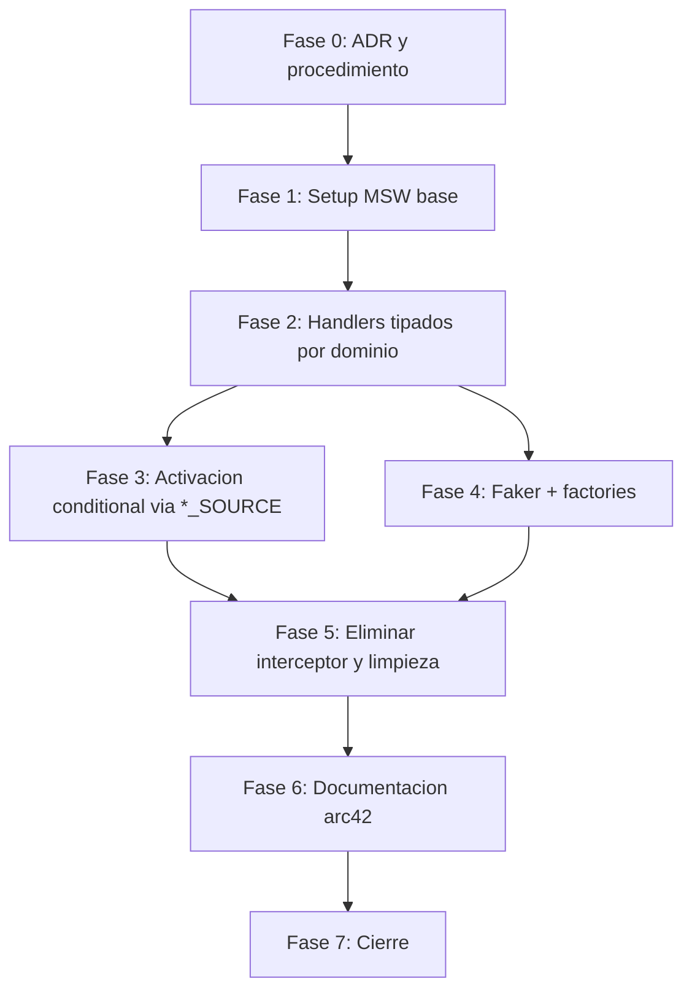

# Plan: Revisar arquitectura de mocks

| Campo | Valor |
|-------|-------|
| Iniciativa | revisar-arquitectura-de-mocks |
| Estado | En ejecucion |
| Version | 0.1.0 |
| Fecha de creacion | 2026-05-21 |
| Camino aprobado | B (superseder ADR, migrar a MSW + Faker) |

> **Como leer este documento.** El plan se organiza en fases.
> Cada fase agrupa tareas atomicas T-NNN que comparten contexto y
> dependencias. Dentro de una fase, las tareas se ejecutan en orden;
> entre fases puede haber paralelismo si el DAG lo permite. Cada
> tarea cierra con un commit Tim Pope. La iniciativa se cierra
> cuando todas las tareas estan hechas y el documento de decisiones
> esta producido.

## Decisiones de diseno aprobadas que entran al plan

- **Camino B**: superseder la ADR `dec-mock-first-via-feature-flags-
  por-dominio` con una nueva ADR `dec-mocks-via-msw-service-worker`.
  Razon detallada en `reconsideracion-bajo-rup-adaptado.md`.
- **3a-ii**: conservar las variables `*_SOURCE` por dominio como
  conditional handlers. El arranque del worker lee las flags y solo
  registra handlers de dominios marcados como `mock`. Esto preserva
  la capacidad de consumir el backend real por dominio cuando llegue.
- **3b-iii**: eliminar los tests embebidos en `src/mocks/
  interceptors/*.test.js` (216 lineas) **verificando tarea por tarea**
  que la cobertura de comportamiento queda preservada por los tests
  de slice/servicio existentes ejercitados con MSW.
- **Enmienda al procedimiento**: anadir a `como-gestionar-iniciativas.
  md` un paso explicito que exige inspeccionar
  `docs/decisiones-de-arquitectura/` antes de proponer cambios
  arquitectonicos. Derivado del fallo de proceso documentado en
  `reconsideracion-bajo-rup-adaptado.md`.

## DAG de dependencias

Fase 0 produce la decision arquitectonica formal **antes** de tocar
codigo. Fase 5 es el punto donde el interceptor desaparece del repo.

## Fase 0: Decision arquitectonica formal y enmienda procedimiento

**Proposito**: registrar la decision bajo disciplina RUP antes de
escribir codigo. Anti-patron: implementar primero, decidir despues.

### T-001 — Superseder ADR previa con dec-mocks-via-msw-service-worker

| Campo | Valor |
|-------|-------|
| Depende de | (ninguna) |
| Archivos | `docs/decisiones-de-arquitectura/decisiones-de-arquitectura.md` |
| Criterio de hecho | (1) La ADR `dec-mock-first-via-feature-flags-por-dominio` tiene `Estado: Superseded por dec-mocks-via-msw-service-worker`. (2) Existe nueva entrada `dec-mocks-via-msw-service-worker` con `Estado: Aceptada`, contexto, alternativas (las 9 evaluadas), razon (referencia al analisis), trade-off del Service Worker (referencia al documento especifico), consecuencias, y evidencia que se rellenara conforme avancen las tareas. (3) La razon documenta explicitamente que la premisa tecnica de la ADR superseded sobre Jest era incorrecta en 2026. |
| Costo | 30 min |

### T-002 — Anadir verificacion de ADRs al procedimiento

| Campo | Valor |
|-------|-------|
| Depende de | (ninguna) |
| Archivos | `docs/pm/como-gestionar-iniciativas.md` |
| Criterio de hecho | El procedimiento contiene un paso explicito (numerado, no enterrado en prosa) que exige: "Antes de proponer cualquier cambio arquitectonico, inspeccionar `docs/decisiones-de-arquitectura/` por ADRs existentes que afecten al tema; si existe ADR previa, leer su contexto y razon, y planificar superseder formalmente si la nueva decision la contradice". |
| Costo | 15 min |

## Fase 1: Setup MSW base

**Proposito**: instalar MSW, generar el Service Worker, crear la
estructura de archivos base sin tocar todavia el interceptor actual.

### T-003 — Instalar msw y configurar workerDirectory

| Campo | Valor |
|-------|-------|
| Depende de | T-001 |
| Archivos | `package.json`, `package-lock.json`, `public/mockServiceWorker.js` |
| Criterio de hecho | (1) `msw` en `devDependencies`. (2) `npx msw init public/ --save` ejecutado; `public/mockServiceWorker.js` existe y esta commiteado. (3) `package.json` tiene `"msw": { "workerDirectory": "public" }` para regeneracion automatica en futuros `npm install`. (4) `npm install` post-cambio no rompe nada. (5) Visitar `http://localhost:8080/mockServiceWorker.js` en dev devuelve el script (smoke test manual). |
| Costo | 20 min |

### T-004 — Crear src/mocks/handlers/index.ts vacio y types base

| Campo | Valor |
|-------|-------|
| Depende de | T-003 |
| Archivos | `src/mocks/handlers/index.ts` (nuevo), `src/mocks/handlers/types.ts` (nuevo) |
| Criterio de hecho | (1) `src/mocks/handlers/index.ts` exporta `handlers: HttpHandler[]` (array vacio inicial). (2) `src/mocks/handlers/types.ts` re-exporta tipos relevantes desde `@types/domain` para uso de todos los handlers. (3) `tsc --noEmit` exit 0. |
| Costo | 15 min |

### T-005 — Crear src/mocks/browser.ts y src/mocks/node.ts

| Campo | Valor |
|-------|-------|
| Depende de | T-004 |
| Archivos | `src/mocks/browser.ts` (nuevo), `src/mocks/node.ts` (nuevo) |
| Criterio de hecho | (1) `browser.ts` exporta `setupWorker(...handlers)` para uso en dev. (2) `node.ts` exporta `setupServer(...handlers)` para uso en Jest. (3) Ambos importan el array `handlers` desde `./handlers/index.ts`. (4) `tsc --noEmit` exit 0. |
| Costo | 15 min |

### T-006 — Integrar worker en src/index.jsx con guard NODE_ENV

| Campo | Valor |
|-------|-------|
| Depende de | T-005 |
| Archivos | `src/index.jsx` |
| Criterio de hecho | (1) Antes del `createRoot`, bloque `if (process.env.NODE_ENV === 'development')` que importa y arranca el worker con `await worker.start({ onUnhandledRequest: 'bypass' })`. (2) Build de produccion no incluye el worker en el bundle JS (verificacion via grep de `mockServiceWorker` en `dist/main.*.js` retorna cero matches). (3) `npm run build` exit 0. (4) `npm run dev` arranca y el worker se registra (smoke test). |
| Costo | 25 min |

### T-007 — Integrar server MSW en setup de Jest

| Campo | Valor |
|-------|-------|
| Depende de | T-005 |
| Archivos | `jest.config.cjs`, `tests/setup-msw.ts` (nuevo o equivalente) |
| Criterio de hecho | (1) Existe archivo `setup-msw.ts` que arranca `server.listen()` en `beforeAll`, `server.resetHandlers()` en `afterEach`, `server.close()` en `afterAll`. (2) `jest.config.cjs` tiene `setupFilesAfterEach` o equivalente apuntando a ese archivo. (3) `npx jest tests/unit src/redux/slices src/utils` pasa 184 tests (los handlers todavia estan vacios, asi que MSW deja pasar las requests; pero el server arranca sin errores). |
| Costo | 25 min |

## Fase 2: Handlers tipados por dominio

**Proposito**: migrar el contenido funcional de `src/mocks/registry.js`
y los sub-interceptores a handlers MSW tipados contra
`src/types/domain.ts`.

### T-008 — Handlers de catalog (productos, categorias, busqueda)

| Campo | Valor |
|-------|-------|
| Depende de | T-007 |
| Archivos | `src/mocks/handlers/catalog.ts` (nuevo), `src/mocks/handlers/index.ts` (anadir) |
| Criterio de hecho | (1) Handlers para todos los endpoints de catalog que el interceptor actual maneja: `GET /api/v1/catalog/products/`, `GET /api/v1/catalog/products/:slug/`, `GET /api/v1/catalog/categories/`, busqueda. (2) Cada handler retorna `HttpResponse.json<PaginatedResponse<Product>>` o el tipo apropiado de `@types/domain`. (3) Datos extraidos textualmente de `registry.js` actual (sin Faker todavia, se anadira en Fase 4). (4) Tests de `catalogSlice` siguen verdes. |
| Costo | 40 min |

### T-009 — Handlers de auth (login, register, profile, password)

| Campo | Valor |
|-------|-------|
| Depende de | T-007 |
| Archivos | `src/mocks/handlers/auth.ts` (nuevo), `src/mocks/handlers/index.ts` (anadir) |
| Criterio de hecho | (1) Handlers para `POST /api/v1/auth/login/`, `POST /api/v1/auth/register/`, `POST /api/v1/auth/logout/`, `GET /api/v1/auth/profile/`, `PATCH /api/v1/auth/profile/`, `POST /api/v1/auth/change-password/`. (2) Tipos `User` y `SerializedApiError` aplicados. (3) Tests de `authSlice` y `authSlice.logging` siguen verdes. |
| Costo | 35 min |

### T-010 — Handlers de cart (cart, applyVoucher)

| Campo | Valor |
|-------|-------|
| Depende de | T-007 |
| Archivos | `src/mocks/handlers/cart.ts` (nuevo), `src/mocks/handlers/index.ts` (anadir) |
| Criterio de hecho | (1) Handlers para los endpoints de carrito y aplicacion de voucher. (2) Tipos `CartItem`, `Voucher`, `VoucherType` aplicados. (3) Tests de `cartSlice.applyVoucher` siguen verdes. |
| Costo | 25 min |

### T-011 — Handlers de payments (initiate, retry)

| Campo | Valor |
|-------|-------|
| Depende de | T-007 |
| Archivos | `src/mocks/handlers/payments.ts` (nuevo), `src/mocks/handlers/index.ts` (anadir) |
| Criterio de hecho | (1) Handlers para `POST /api/v1/payments/mercadopago/initiate/` y `POST /api/v1/payments/retry/`. (2) Tests de `paymentsSlice` siguen verdes. |
| Costo | 25 min |

### T-012 — Handlers de inventory y returns

| Campo | Valor |
|-------|-------|
| Depende de | T-007 |
| Archivos | `src/mocks/handlers/inventory.ts` (nuevo), `src/mocks/handlers/returns.ts` (nuevo), `src/mocks/handlers/index.ts` (anadir) |
| Criterio de hecho | (1) Migracion funcional de `src/mocks/interceptors/inventory.js` (167 lineas) y `returns.js` (197 lineas) a handlers MSW tipados. (2) Comportamiento de los handlers cubre los casos de los tests embebidos `inventory.test.js` y `returns.test.js`. (3) Antes de pasar a Fase 5, verificar que los casos de uso de esos tests embebidos quedan cubiertos por tests de slice/servicio existentes; si no, escribir tests adicionales aqui mismo. |
| Costo | 40 min |

## Fase 3: Activacion conditional via *_SOURCE

**Proposito**: implementar 3a-ii. El worker lee `CATALOG_SOURCE`,
`AUTH_SOURCE`, `CART_SOURCE`, `PAYMENTS_SOURCE` y solo registra
handlers de dominios marcados como `mock`.

### T-013 — Implementar conditional handler registration

| Campo | Valor |
|-------|-------|
| Depende de | T-008, T-009, T-010, T-011, T-012 |
| Archivos | `src/mocks/handlers/index.ts`, `src/mocks/browser.ts`, `src/mocks/node.ts` |
| Criterio de hecho | (1) `src/mocks/handlers/index.ts` no exporta un array plano sino una funcion `buildHandlers(): HttpHandler[]` que lee `process.env.CATALOG_SOURCE`, `AUTH_SOURCE`, `CART_SOURCE`, `PAYMENTS_SOURCE` y compone el array seleccionando solo los handlers de dominios `mock`. (2) `browser.ts` llama `buildHandlers()` antes de `setupWorker`. (3) `node.ts` idem antes de `setupServer`. (4) Smoke test manual: con `CATALOG_SOURCE=real` y resto `mock`, requests a `/api/v1/catalog/*` salen al backend real (caen con error de conexion si no hay backend; lo importante es que el handler MSW no las intercepte). (5) Documentar el comportamiento en JSDoc del archivo. |
| Costo | 30 min |

## Fase 4: Faker + factories

**Proposito**: anadir realismo a los datos mock. Las factories tipadas
contra `domain.ts` permiten generar variabilidad sin perder
trazabilidad con el dominio.

### T-014 — Instalar faker-js y crear factories base

| Campo | Valor |
|-------|-------|
| Depende de | T-008 |
| Archivos | `package.json`, `package-lock.json`, `src/mocks/factories/index.ts` (nuevo), `src/mocks/factories/product.ts`, `src/mocks/factories/user.ts`, `src/mocks/factories/cart.ts`, `src/mocks/factories/order.ts`, `src/mocks/factories/voucher.ts` |
| Criterio de hecho | (1) `@faker-js/faker` en `devDependencies`. (2) Una factory por entidad principal con signatura `createX(overrides: Partial<X> = {}): X` tipada contra `@types/domain`. (3) Cada factory usa Faker para campos variables (nombres, precios, ids) y respeta el contrato del dominio (e.g. `Product.base_price` siempre numero). (4) `tsc --noEmit` exit 0. |
| Costo | 45 min |

### T-015 — Anadir variabilidad realista a handlers de catalog y auth

| Campo | Valor |
|-------|-------|
| Depende de | T-013, T-014 |
| Archivos | `src/mocks/handlers/catalog.ts`, `src/mocks/handlers/auth.ts` |
| Criterio de hecho | (1) Los handlers de listados (`GET /api/v1/catalog/products/`) usan `createProduct()` para generar N productos en vez de devolver 3 hardcoded. (2) Los handlers de detalle (`GET /api/v1/catalog/products/:slug/`) preservan slugs estables (no aleatorios) para que los tests sigan siendo deterministicos. (3) Tests siguen verdes (deterministico donde los tests lo exigen, variable en listados libres). |
| Costo | 30 min |

## Fase 5: Eliminar interceptor y limpieza

**Proposito**: punto de no-retorno. El interceptor desaparece del
codigo. `apiService` vuelve a ser cliente HTTP plano.

### T-016 — Eliminar mockInterceptor de apiService._request

| Campo | Valor |
|-------|-------|
| Depende de | T-013 (handlers conditionally registered y validados) |
| Archivos | `src/services/apiService.js` |
| Criterio de hecho | (1) La linea `import mockInterceptor from '@mocks/mockInterceptor';` removida. (2) El bloque que llama `mockInterceptor.intercept` en `_request` removido. (3) `_request` es un cliente HTTP plano (fetch + manejo de error). (4) Los 184 tests pasan (ahora ejercitando los handlers MSW). |
| Costo | 25 min |

### T-017 — Eliminar src/mocks/mockInterceptor.js y registry.js

| Campo | Valor |
|-------|-------|
| Depende de | T-016 |
| Archivos | `src/mocks/mockInterceptor.js` (eliminar), `src/mocks/registry.js` (eliminar) |
| Criterio de hecho | (1) Ambos archivos eliminados con `git rm`. (2) Ningun import roto: `grep -rn "mockInterceptor\|@mocks/mockInterceptor\|@mocks/registry" src/ tests/` retorna cero matches. (3) `tsc --noEmit` exit 0. (4) Tests pasan. |
| Costo | 15 min |

### T-018 — Eliminar src/mocks/interceptors/ con verificacion de cobertura

| Campo | Valor |
|-------|-------|
| Depende de | T-016, T-012 |
| Archivos | `src/mocks/interceptors/inventory.js` (eliminar), `src/mocks/interceptors/inventory.test.js` (eliminar), `src/mocks/interceptors/returns.js` (eliminar), `src/mocks/interceptors/returns.test.js` (eliminar) |
| Criterio de hecho | (1) **Antes de eliminar**, verificar tarea por tarea que cada caso de uso cubierto por los 216 lineas de tests embebidos queda cubierto en tests de slice/servicio existentes ejercitados con los handlers MSW de T-012. Si algun caso no esta cubierto, escribir el test adicional antes de eliminar. (2) Una vez verificada cobertura, los cuatro archivos eliminados con `git rm`. (3) Conteo total de tests: si pasamos de 184 a un numero menor, justificar en el commit message exactamente que tests se removieron y donde quedo cubierto el caso. (4) `tsc --noEmit` exit 0. |
| Costo | 45 min |

### T-019 — Reevaluar variables *_SOURCE en webpack DefinePlugin

| Campo | Valor |
|-------|-------|
| Depende de | T-013, T-017 |
| Archivos | `webpack.config.js` |
| Criterio de hecho | (1) Inspeccion del codigo restante (`grep -rn "_SOURCE" src/`) para verificar que las variables aun se leen donde tiene sentido (handlers MSW las usan; otras lecturas residuales en codigo de produccion se examinan caso por caso). (2) Las variables se conservan en `defaultFlags` y `buildDefinedEnv` con comentario actualizado explicando que ahora controlan conditional handler registration de MSW, no ramas en `apiService`. (3) Tests pasan. |
| Costo | 20 min |

## Fase 6: Documentacion arc42

**Proposito**: actualizar la documentacion de arquitectura para que
refleje la nueva pieza.

### T-020 — Actualizar vista-de-bloques-de-construccion

| Campo | Valor |
|-------|-------|
| Depende de | T-019 |
| Archivos | `docs/vista-de-bloques-de-construccion/vista-de-bloques-de-construccion.md` |
| Criterio de hecho | (1) Se anade o actualiza la descripcion del bloque "Mocks" reflejando MSW (Service Worker en navegador, server en Node para tests) en vez de "interceptor in-process". (2) Si hay diagrama mermaid, se actualiza la pieza correspondiente. (3) Referencia explicita a la ADR nueva `dec-mocks-via-msw-service-worker`. |
| Costo | 25 min |

### T-021 — Documentar arranque conditional via *_SOURCE en como-adaptar

| Campo | Valor |
|-------|-------|
| Depende de | T-019 |
| Archivos | `docs/como-adaptar-este-template.md` |
| Criterio de hecho | (1) Se anade una seccion explicando como un adoptante activa o desactiva mocks por dominio via las variables `*_SOURCE`. (2) Tabla con los cuatro dominios y el archivo de handler correspondiente para que el adoptante sepa donde tocar. |
| Costo | 20 min |

### T-022 — Actualizar README de la raiz si menciona el interceptor

| Campo | Valor |
|-------|-------|
| Depende de | T-019 |
| Archivos | `README.md` |
| Criterio de hecho | (1) `grep -ni "interceptor\|mockInterceptor" README.md` revisado; cualquier mencion al interceptor anterior actualizada a MSW. (2) Si el README no mencionaba el interceptor, esta tarea cierra como "no aplica" sin commit (se registra en progreso). |
| Costo | 10 min |

## Fase 7: Cierre

### T-023 — Producir decisiones-revisar-arquitectura-de-mocks.md

| Campo | Valor |
|-------|-------|
| Depende de | Todas las anteriores |
| Archivos | `docs/pm/iniciativas/revisar-arquitectura-de-mocks/decisiones-revisar-arquitectura-de-mocks.md` (nuevo) |
| Criterio de hecho | (1) Documento producido con las cuatro secciones del PROC-GESTION-001: decisiones de diseno (Camino B + 3a-ii + 3b-iii + enmienda procedimiento), hallazgos durante la ejecucion (los que se registren en progreso-*.md), verificacion post-ejecucion (tests, build, ADR superseded, etc.), que entrega esta iniciativa. (2) Referencias cruzadas a `analisis-*.md`, `analisis-trade-off-*.md`, `reconsideracion-bajo-rup-adaptado.md`. |
| Costo | 45 min |

### T-024 — Cerrar iniciativa formalmente

| Campo | Valor |
|-------|-------|
| Depende de | T-023 |
| Archivos | `docs/pm/iniciativas/revisar-arquitectura-de-mocks/index.md`, `docs/pm/iniciativas/indice-de-iniciativas.md`, `docs/pm/iniciativas/revisar-arquitectura-de-mocks/progreso-*.md` |
| Criterio de hecho | (1) `index.md` cambia estado de `En ejecucion` a `Cerrada`, anade fecha de cierre, actualiza el catalogo interno y el bloque "Estado vs PROC-GESTION-001". (2) `indice-de-iniciativas.md` mueve la fila a `Cerrada`. (3) `progreso-*.md` registra `Cambio de estado` y `Cierre de iniciativa`. (4) Iniciativa proxima en backlog (`validar-contrato-de-mocks-vs-backend-real`) sigue siendo orden 2 al cerrar (no cambia hasta que se abra). |
| Costo | 25 min |

## Tabla agregada por fase

| Fase | Tareas | Costo aprox. |
|------|--------|--------------|
| 0 | T-001, T-002 | 45 min |
| 1 | T-003 a T-007 | 100 min |
| 2 | T-008 a T-012 | 165 min |
| 3 | T-013 | 30 min |
| 4 | T-014, T-015 | 75 min |
| 5 | T-016 a T-019 | 105 min |
| 6 | T-020 a T-022 | 55 min |
| 7 | T-023, T-024 | 70 min |
| **Total** | **24 tareas** | **~645 min (10.75 horas efectivas)** |

## Trazabilidad

| Decision | Tareas que la materializan |
|----------|----------------------------|
| Camino B (superseder ADR + migrar a MSW) | T-001 (supersede) + Fase 1 a 5 (migracion) |
| 3a-ii (conditional handlers via *_SOURCE) | T-013, T-019 |
| 3b-iii (eliminar tests embebidos verificando cobertura) | T-018 |
| Enmienda al procedimiento (verificar ADRs) | T-002 |
| Faker + factories | T-014, T-015 |
