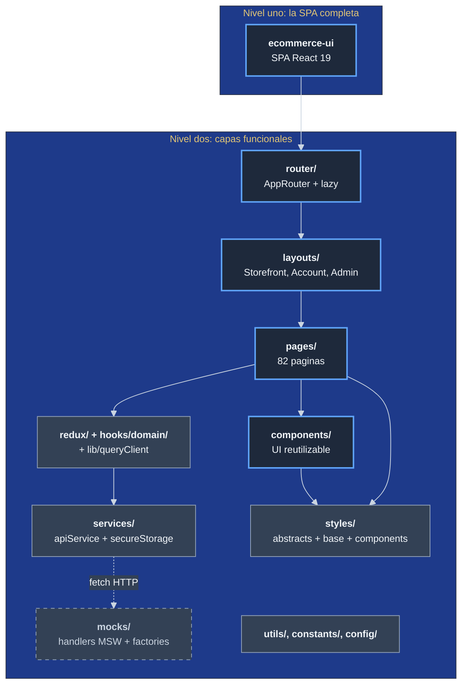
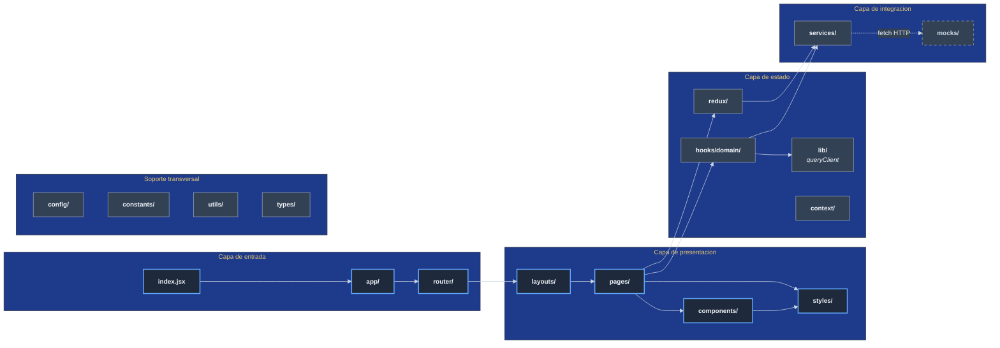

# Vista de bloques de construccion

Esta vista describe la **estructura interna del codigo**. Cada bloque
corresponde a una carpeta dentro de `src/` y tiene una responsabilidad
acotada.

## Vision general en niveles

La flecha `Services -. fetch HTTP .-> Mocks` se dibuja punteada
porque NO es una llamada directa de codigo a codigo. `apiService`
hace `fetch` standard; en desarrollo el Service Worker registrado
por `mocks/browser.ts` intercepta esa request HTTP y la responde
con un handler. En produccion el worker no se registra (guard
`NODE_ENV !== 'production'` mas tree shaking), y la flecha se
extingue.

## Catalogo de bloques

### Bloque `app/`

Componente raiz (`App.jsx`) y listeners globales montados una sola vez
arriba del router. Contiene:

- `App.jsx`: providers (Redux, React Query, Toast) + `AppRouter`.
- `UnauthorizedListener.jsx`: escucha el evento `app:unauthorized` y
  redirige al login (introducido en la rama pendiente
  `claude/resume-ecommerce-project-Dm3ab`).

### Bloque `router/`

Define las rutas de la SPA. Toda pagina se carga con `React.lazy`.
Tres familias de rutas:

| Familia | Layout | Protegida | Ejemplos |
|---------|--------|-----------|----------|
| Publica | `StorefrontLayout` | No | `/`, `/catalog`, `/product/:slug`, `/auth/login` |
| Comprador | `AccountLayout` | `ProtectedRoute` | `/account/orders`, `/account/wishlist`, `/account/returns` |
| Admin | `AdminLayout` | `AdminRoute` | `/admin/products`, `/admin/orders`, `/admin/config` |

### Bloque `layouts/`

Tres shells visuales que envuelven las paginas (`StorefrontLayout`,
`AccountLayout`, `AdminLayout`). Cada uno incluye header, sidebar y
footer adecuados a su rol.

### Bloque `pages/`

82 paginas distribuidas en seis subcarpetas:

| Subcarpeta | Paginas | Que contiene |
|------------|---------|--------------|
| `pages/home/` | 1 | Landing publica |
| `pages/catalog/` | varias | Listado, detalle, busqueda, preguntas, reviews |
| `pages/cart/` | varias | Carrito |
| `pages/checkout/` | varias | Checkout, seleccion de pago, exito |
| `pages/auth/` | varias | Login, register, forgot, reset, verify |
| `pages/account/` | muchas | Cuenta del comprador: ordenes, wishlist, devoluciones, soporte, notificaciones, payments, search history, **deactivate** (rama pendiente) |
| `pages/admin/` | muchas | Panel administrativo: usuarios, productos, ordenes, vouchers, support, audit, backups, config, logistics, reports |

### Bloque `components/`

UI reutilizable agrupado por dominio:

- `common/`: Button, Card, Form, Toast, Badge, Skeleton.
- `layout/`: Header, Footer, Sidebar.
- `shared/`: `ProtectedRoute`, `AdminRoute`, `ErrorBoundary`, `LazyLoad/PageLoader`.
- `admin/`, `catalog/`, `returns/`, `support/`, `wishlist/`: piezas
  especificas de cada dominio que se reutilizan entre paginas.

### Bloque `redux/`

Store global con 31 slices. Tres familias:

| Familia | Slices |
|---------|--------|
| Sesion y usuarios | `authSlice`, `adminUsersSlice`, `permissionsSlice` |
| Comercio | `catalogSlice`, `cartSlice`, `checkoutSlice`, `ordersSlice`, `paymentsSlice`, `wishlistSlice`, `productsSlice`, `productDiscountsSlice`, `productVariantsSlice` |
| Operaciones | `inventorySlice`, `logisticsSlice`, `returnsSlice`, `supportTicketsSlice`, `priceSyncSlice`, `vouchersSlice`, `searchHistorySlice` |
| Soporte y configuracion | `reviewsSlice`, `questionsSlice`, `notificationsSlice`, `contactSlice`, `newsletterSlice`, `settingsSlice`, `backupsSlice`, `addressesSlice`, `categoriesSlice`, `adminSlice`, `uiSlice`, `errorSlice` |

Mas `redux/middleware/errorHandling.js` para captura global de errores
y `redux/selectors/` con selectores memoizados.

### Bloque `hooks/domain/`

32 hooks de dominio que envuelven React Query y/o thunks de Redux para
exponer una API estable a las paginas. Ejemplos: `useAuth`, `useCart`,
`useOrders`, `useAdminUsers`, `useReturns`, `useInventory`,
`useVouchers`.

### Bloque `services/`

| Archivo | Responsabilidad |
|---------|-----------------|
| `apiService.js` | Cliente HTTP unico. Timeout (30s), retry (3 intentos con backoff), interceptores request/response/error. Dispara evento global `app:unauthorized` en 401. **Agnostico del modo mock**: los mocks se inyectan a nivel de red via MSW (ver bloque `mocks/`), no en este archivo. |
| `createResilientService.js` | Factoria para servicios con politicas adicionales (circuit breaker). |
| `secureStorage.js` | Wrapper sobre storage del navegador para datos no sensibles. |
| `utils/apiErrors.js` | Tipos de error tipados (`TimeoutError`, `NetworkError`, `createErrorFromResponse`). |

### Bloque `mocks/`

Mocks REST implementados con [Mock Service Worker (MSW)](https://mswjs.io/).
Los handlers interceptan a nivel de red: en navegador via un Service
Worker registrado por `browser.ts`, en Jest via el modulo `http` de
Node interceptado por `node.ts`. El codigo de produccion
(`apiService.js`, slices, paginas) **no sabe** que existe la capa
mock; la conmutacion mock-vs-real ocurre fuera del bundle de
produccion via los flags `*_SOURCE` que componen el array de
handlers en `buildHandlers()`.

Estructura:

| Archivo | Responsabilidad |
|---------|-----------------|
| `mocks/handlers/index.ts` | `buildHandlers()` lee `CATALOG_SOURCE`, `AUTH_SOURCE`, `CART_SOURCE`, `PAYMENTS_SOURCE`, `PROFILE_SOURCE` y compone el array final. Default: todo en `mock`. |
| `mocks/handlers/catalog.ts`, `auth.ts`, `cart.ts`, `payments.ts`, `inventory.ts`, `returns.ts` | Un archivo por dominio. Cada uno exporta su array de `http.get/post/...` con shapes tipados contra `src/types/domain.ts`. |
| `mocks/handlers/types.ts` | Re-export central de los 12 tipos del dominio. |
| `mocks/factories/index.ts` | `createProduct`, `createUser`, `createCartItem`, `createOrder`, `createVoucher` con @faker-js/faker. Listados usan factories para variabilidad; detalles preservan determinismo via seed estable. |
| `mocks/browser.ts` | `setupWorker(...buildHandlers())` para uso en dev. Importado dinamicamente desde `src/index.jsx` con guard `NODE_ENV !== 'production'` para tree shaking. |
| `mocks/node.ts` | `setupServer(...buildHandlers())` para Jest. Importado desde `jest.setup.js` con lifecycle `listen` / `resetHandlers` / `close`. |
| `public/mockServiceWorker.js` | Generado por `npx msw init`, commiteado. Regeneracion automatica via `msw.workerDirectory` en `package.json` durante `npm install`. NO se copia a `dist/` (el template no usa `copy-webpack-plugin`). |

Decision arquitectonica registrada como
`dec-mocks-via-msw-service-worker` (supersede de
`dec-mock-first-via-feature-flags-por-dominio`). Ver tambien
`pm/iniciativas/revisar-arquitectura-de-mocks/` para el analisis
completo y los trade-offs evaluados.

### Bloque `styles/`

Sistema de estilos en cinco capas:

| Capa | Carpeta | Que contiene |
|------|---------|--------------|
| Tokens | `styles/abstracts/` | `_variables.scss`, `_mixins.scss`, paleta del template |
| Reset y tipografia | `styles/base/` | `_reset.scss`, `_typography.scss` |
| Componentes globales | `styles/components/` | `_buttons.scss`, `_cards.scss`, `_forms.scss` |
| Layouts | `styles/layouts/` | `_header.scss`, `_sidebar.scss` |
| Utilidades | `styles/utils/` | `_utilities.scss` |

Mas SCSS Modules adyacentes a cada componente (`*.module.scss`).
El pipeline esta endurecido por stylelint + `check-scss.mjs` +
husky pre-push (ver `conceptos-transversales/`).

### Bloque `config/`

Politicas centralizadas (CSP, cookies, HSTS, rate limit). El backend
es quien las aplica; este archivo documenta la expectativa del UI.

### Bloque `constants/`, `utils/`, `context/`, `lib/`

| Bloque | Contenido |
|--------|-----------|
| `constants/` | Constantes de dominio (estados, rutas, moneda). |
| `utils/` | Helpers puros (`formatters.js` para precios/fechas/SKU). |
| `context/` | `ToastContext` (notificaciones de UI). |
| `lib/` | `queryClient.js` (instancia de React Query). |

## Diagrama UML de paquetes del nivel uno

## Reglas de dependencia entre bloques

Estas reglas son **observables en el codigo** y reforzadas parcialmente
por configuracion del bundler y por scripts en `scripts/`:

1. `pages/` puede importar de `components/`, `hooks/`, `redux/`,
   `utils/`, `constants/`, `styles/`. **No** importa de otras paginas.
2. `components/` puede importar de `hooks/`, `utils/`, `constants/`,
   `styles/`. **No** importa de `pages/`.
3. `hooks/domain/` puede importar de `redux/`, `services/`, `lib/`,
   `utils/`. **No** importa de `pages/` ni `components/`.
4. `redux/slices/` puede importar de `services/`, `utils/`. **No**
   importa de `pages/`, `components/`, ni otros slices directamente
   (composicion via selectores).
5. `services/` solo conoce `utils/`, `config/`. **NO** importa de
   `mocks/` (la intercepcion mock ocurre a nivel de red, no de codigo).
6. `mocks/` no importa de produccion mas alla de `utils/` y `types/`.
7. **Lazy loading solo via `React.lazy`.** Cualquier otro `import()`
   dinamico o `require()` dentro de funcion esta prohibido por
   `scripts/check-no-lazy-imports.mjs` (introducido en la rama
   pendiente).

## Bloques que no estan declarados arriba pero existen

| Carpeta | Estado |
|---------|--------|
| `src/decorators/` | 4 archivos. Decoradores experimentales para componentes. Sin documentacion formal. |
| `src/hooks/utils/` | Hooks utilitarios separados de los de dominio. |
| `src/styles/accessibility/` | Reglas de a11y. |
| `src/types/` | 1 archivo. Tipos compartidos (proyecto sin TypeScript en src, este archivo es la excepcion). |

Estos bloques se documentaran cuando se decida si quedan o se
absorben en otros bloques. Esta deuda esta listada en
`riesgos-y-deuda-tecnica/`.
