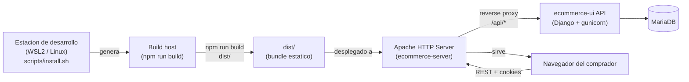
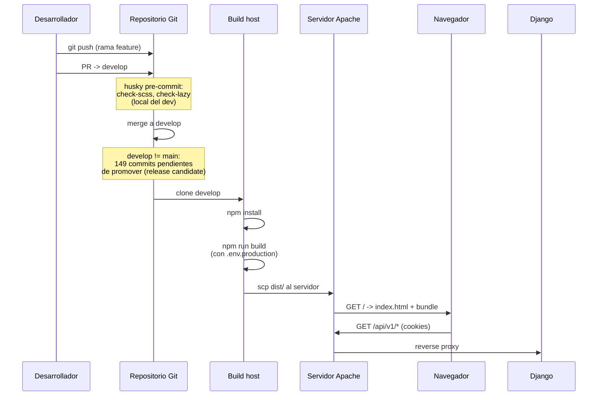

# Vista de despliegue

Este documento describe **donde corre el sistema en produccion** y
**como se produce el artefacto de despliegue**.

## Topologia de despliegue



## Nodos de despliegue

### Nodo: estacion de desarrollo

Se aprovisiona con `scripts/install.sh` (introducido en la rama
pendiente `claude/resume-ecommerce-project-Dm3ab`).

| Aspecto | Detalle |
|---------|---------|
| Sistema operativo | Linux nativo o WSL2 (Ubuntu) |
| Node.js | 22 LTS via repositorio oficial de NodeSource (apt) |
| npm | >= 10 (incluido con Node 22) |
| Usuarios involucrados | `deploy` (invocador de sudo) ejecuta install; `develop` lo consume sin sudo |
| Localizacion del runtime | `/usr/bin/node`, `/usr/bin/npm` — accesibles cross-user |
| Por que NodeSource y no nvm | nvm instala bajo `$HOME/.nvm/`; en WSL2 con usuarios separados eso obliga a reinstalar por cada usuario. NodeSource via apt es global y world-readable. |

El script es **idempotente**: si la version objetivo ya esta
instalada, no hace nada. La cobertura del provisioner esta validada
por `tests/test_provisioner_setup.sh`.

### Nodo: build host

Cualquier maquina con Node 22 LTS puede producir el bundle:

| Comando | Resultado |
|---------|-----------|
| `npm install` | Instala dependencias en `node_modules/` |
| `npm run build` | Produce `dist/` con `mode=production` |
| `npm run build:analyze` | Igual mas reporte de bundle (`ANALYZE=true`) |
| `npm test` | Suite Jest completa |
| `npm run lint` | ESLint sobre `src/` |
| `npm run lint:style` | Stylelint sobre SCSS |
| `npm run lint:scss-compile` | `scripts/check-scss.mjs` verifica que el SCSS compila |
| `npm run check:lazy` | `scripts/check-no-lazy-imports.mjs` (rama pendiente) |

La configuracion sensible se inyecta en build time via `DefinePlugin`:

| Variable | Origen | Inyectada como |
|----------|--------|----------------|
| `API_URL` | shell env > `.env.production` > fallback `http://localhost:8000` | `process.env.API_URL` (string literal) |
| `APP_VERSION` | `package.json#version` | `process.env.APP_VERSION` |
| `*_SOURCE` | `.env*` files o defaults | `process.env.*_SOURCE` |
| `NODE_ENV` | argumento `--mode` | `process.env.NODE_ENV` |

> Hallazgo de la rama pendiente: el commit `c9c3465` mueve la
> resolucion de `.env` files **dentro** del callback de webpack para
> que `API_URL` de `.env.production` se respete cuando el shell no la
> exporta. Antes, la resolucion ocurria al cargar el modulo y se
> cacheaba con un valor incorrecto.

### Nodo: servidor de produccion

El bundle `dist/` se sirve estatico desde Apache, en un nodo separado
provisionado por `ecommerce-server` (Ubuntu + Apache + acme.sh +
fail2ban). Detalles relevantes para el UI:

| Aspecto | Detalle |
|---------|---------|
| Servidor web | Apache 2 |
| HTTPS | Certificado emitido y renovado por `acme.sh` |
| `/api/*` | Reverse proxy hacia Django (gunicorn) en el mismo host |
| Cookies | Politicas `Secure`, `HttpOnly`, `SameSite=Strict` aplicadas por Django; el UI las consume tal cual |
| Headers de seguridad | CSP, HSTS, X-Frame-Options, Referrer-Policy — emitidos por Apache segun `src/config/security.js` |
| Fail2ban | Bloquea brute force sobre `/api/v1/auth/login/` por ventana movil |
| Logs | Apache `access.log` + `error.log` |

El UI **no requiere Node en produccion**. El servidor solo sirve
estaticos para `/` y `/static/*`, y proxy-pasa `/api/*` a Django.

## Configuracion por entorno

| Entorno | Comando | Variables de entorno |
|---------|---------|----------------------|
| Desarrollo local | `npm run dev` (webpack-dev-server, puerto 3001) | `.env.local` (gitignored) + `.env.example` como plantilla. `*_SOURCE=mock` por defecto. |
| Build de produccion | `npm run build` con `NODE_ENV=production` | `.env.production` (gitignored) + `.env.production.example` como plantilla. `API_URL` apunta al dominio real. |
| Staging | Mismo build que produccion pero con `API_URL` apuntando al backend de staging | Plantilla propia (no en repo). |

## Artefactos producidos por el build

| Artefacto | Localizacion | Naturaleza |
|-----------|--------------|------------|
| Bundle JS principal | `dist/main.<contenthash>.js` | Codigo de la app |
| Chunks por ruta | `dist/<page>.<contenthash>.chunk.js` | Cada lazy import produce un chunk |
| CSS extraido | `dist/main.<contenthash>.css` | Generado por `mini-css-extract-plugin` |
| HTML de entrada | `dist/index.html` | Generado por `html-webpack-plugin` con referencias a los hashes actuales |
| Cache de webpack | `.webpack_cache/` | No se despliega; acelera rebuilds locales |
| Reporte de bundle | `dist/bundle-report.html` | Solo con `build:analyze` |

## Pipeline de despliegue (estado actual)



Este pipeline es **manual**. No hay CI/CD configurado en el repo. Esto
esta listado en `riesgos-y-deuda-tecnica/`.

## Verificacion antes del deploy

El template ofrece dos mecanismos complementarios para reducir la
probabilidad de subir un bundle con `API_URL` incorrecta. El operador
ejecuta el primero antes de copiar `dist/` al servidor; usa el
segundo para confirmar despues que el servidor sirve lo esperado.

### Paso 1 — Inspeccionar el bundle con `verify-build`

```
npm run build
npm run verify-build
```

Sin argumentos, el script lista todas las URLs http(s) inyectadas en
`dist/main.*.js` y aplica dos guard rails:

- Falla con exit 1 si **ninguna** URL significativa aparece en el
  bundle (sintoma de `process.env.API_URL` vacio en build time).
- Falla con exit 1 si encuentra `localhost` o `127.0.0.1` en el
  bundle. Para builds de desarrollo intencionales se pasa
  `--allow-localhost`.

Para el deploy a produccion el operador conoce la URL esperada y la
exige explicitamente:

```
npm run build
npm run verify-build -- --expected=https://api.prod.example.com
```

Si el bundle no contiene esa URL, el script falla; el operador
revisa `.env.production`, vuelve a construir y repite.

### Paso 2 — Confirmar runtime con `window.__APP_CONFIG__`

Tras desplegar y abrir el sitio en el navegador, en la consola de
DevTools:

```
window.__APP_CONFIG__
```

Devuelve un objeto inmutable con tres campos:

| Campo | Significado |
|-------|-------------|
| `apiUrl` | El `API_URL` que el bundle servido hara consumir al cliente. Debe coincidir con la URL inyectada en build time y validada por `verify-build`. |
| `version` | La `version` de `package.json` en el commit del que salio el build. |
| `builtAt` | Timestamp ISO 8601 del momento en que se ejecuto `npm run build`. Permite detectar despliegues que sirven un bundle obsoleto cuando un balanceador o cache CDN no se invalido. |

El objeto esta congelado con `Object.freeze` para evitar mutaciones
accidentales desde la consola.

### Cuando algo no coincide

| Sintoma | Hipotesis primera | Verificacion |
|---------|-------------------|--------------|
| `apiUrl` apunta a localhost en produccion | `.env.production` no se cargo; build se hizo sin `API_URL` definida | Repetir build con `API_URL=...` en el entorno del build host |
| `apiUrl` apunta a un host antiguo tras un deploy | Apache sirve el bundle anterior porque `dist/` no se reemplazo completo | `builtAt` lo confirma; rsync con `--delete` o invalidar cache del proxy |
| `window.__APP_CONFIG__` es `undefined` | El servidor sirve un build muy antiguo previo a esta convencion | Forzar `npm run build` desde un commit posterior a T-022 de la iniciativa `resolver-hallazgos-de-deuda-del-template` |
